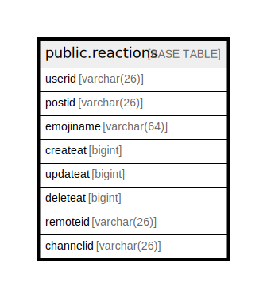

# public.reactions

## 概要

## カラム一覧

| 名前        | タイプ         | デフォルト値                | NULL許可   | 子テーブル      | 親テーブル      | コメント     |
| --------- | ----------- | --------------------- | -------- | ---------- | ---------- | -------- |
| userid    | varchar(26) |                       | false    |            |            |          |
| postid    | varchar(26) |                       | false    |            |            |          |
| emojiname | varchar(64) |                       | false    |            |            |          |
| createat  | bigint      |                       | true     |            |            |          |
| updateat  | bigint      |                       | true     |            |            |          |
| deleteat  | bigint      |                       | true     |            |            |          |
| remoteid  | varchar(26) |                       | true     |            |            |          |
| channelid | varchar(26) | ''::character varying | false    |            |            |          |

## 制約一覧

| 名前             | タイプ         | 定義                                      |
| -------------- | ----------- | --------------------------------------- |
| reactions_pkey | PRIMARY KEY | PRIMARY KEY (postid, userid, emojiname) |

## INDEX一覧

| 名前                       | 定義                                                                                             |
| ------------------------ | ---------------------------------------------------------------------------------------------- |
| reactions_pkey           | CREATE UNIQUE INDEX reactions_pkey ON public.reactions USING btree (postid, userid, emojiname) |
| idx_reactions_channel_id | CREATE INDEX idx_reactions_channel_id ON public.reactions USING btree (channelid)              |

## ER図

---

> Generated by [tbls](https://github.com/k1LoW/tbls)
