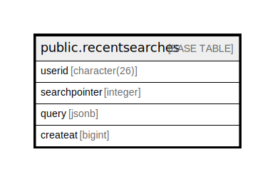

# public.recentsearches

## 概要

## カラム一覧

| 名前            | タイプ           | デフォルト値       | NULL許可   | 子テーブル      | 親テーブル      | コメント     |
| ------------- | ------------- | ------------ | -------- | ---------- | ---------- | -------- |
| userid        | character(26) |              | false    |            |            |          |
| searchpointer | integer       |              | false    |            |            |          |
| query         | jsonb         |              | true     |            |            |          |
| createat      | bigint        |              | false    |            |            |          |

## 制約一覧

| 名前                  | タイプ         | 定義                                  |
| ------------------- | ----------- | ----------------------------------- |
| recentsearches_pkey | PRIMARY KEY | PRIMARY KEY (userid, searchpointer) |

## INDEX一覧

| 名前                  | 定義                                                                                                   |
| ------------------- | ---------------------------------------------------------------------------------------------------- |
| recentsearches_pkey | CREATE UNIQUE INDEX recentsearches_pkey ON public.recentsearches USING btree (userid, searchpointer) |

## ER図

---

> Generated by [tbls](https://github.com/k1LoW/tbls)
