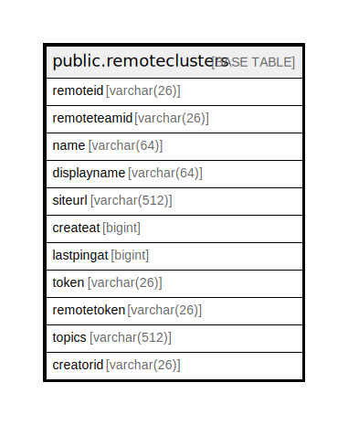

# public.remoteclusters

## 概要

## カラム一覧

| 名前           | タイプ          | デフォルト値       | NULL許可   | 子テーブル      | 親テーブル      | コメント     |
| ------------ | ------------ | ------------ | -------- | ---------- | ---------- | -------- |
| remoteid     | varchar(26)  |              | false    |            |            |          |
| remoteteamid | varchar(26)  |              | true     |            |            |          |
| name         | varchar(64)  |              | false    |            |            |          |
| displayname  | varchar(64)  |              | true     |            |            |          |
| siteurl      | varchar(512) |              | true     |            |            |          |
| createat     | bigint       |              | true     |            |            |          |
| lastpingat   | bigint       |              | true     |            |            |          |
| token        | varchar(26)  |              | true     |            |            |          |
| remotetoken  | varchar(26)  |              | true     |            |            |          |
| topics       | varchar(512) |              | true     |            |            |          |
| creatorid    | varchar(26)  |              | true     |            |            |          |

## 制約一覧

| 名前                  | タイプ         | 定義                           |
| ------------------- | ----------- | ---------------------------- |
| remoteclusters_pkey | PRIMARY KEY | PRIMARY KEY (remoteid, name) |

## INDEX一覧

| 名前                              | 定義                                                                                                               |
| ------------------------------- | ---------------------------------------------------------------------------------------------------------------- |
| remoteclusters_pkey             | CREATE UNIQUE INDEX remoteclusters_pkey ON public.remoteclusters USING btree (remoteid, name)                    |
| remote_clusters_site_url_unique | CREATE UNIQUE INDEX remote_clusters_site_url_unique ON public.remoteclusters USING btree (siteurl, remoteteamid) |

## ER図

---

> Generated by [tbls](https://github.com/k1LoW/tbls)
