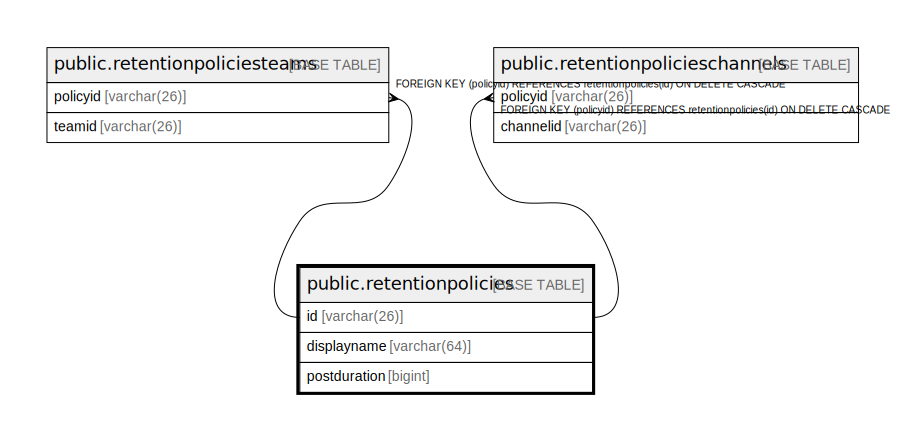

# public.retentionpolicies

## 概要

## カラム一覧

| 名前           | タイプ         | デフォルト値       | NULL許可   | 子テーブル                                                                                                                                     | 親テーブル      | コメント     |
| ------------ | ----------- | ------------ | -------- | ----------------------------------------------------------------------------------------------------------------------------------------- | ---------- | -------- |
| id           | varchar(26) |              | false    | [public.retentionpoliciesteams](public.retentionpoliciesteams.md) [public.retentionpolicieschannels](public.retentionpolicieschannels.md) |            |          |
| displayname  | varchar(64) |              | true     |                                                                                                                                           |            |          |
| postduration | bigint      |              | true     |                                                                                                                                           |            |          |

## 制約一覧

| 名前                     | タイプ         | 定義               |
| ---------------------- | ----------- | ---------------- |
| retentionpolicies_pkey | PRIMARY KEY | PRIMARY KEY (id) |

## INDEX一覧

| 名前                                | 定義                                                                                                   |
| --------------------------------- | ---------------------------------------------------------------------------------------------------- |
| retentionpolicies_pkey            | CREATE UNIQUE INDEX retentionpolicies_pkey ON public.retentionpolicies USING btree (id)              |
| idx_retentionpolicies_displayname | CREATE INDEX idx_retentionpolicies_displayname ON public.retentionpolicies USING btree (displayname) |

## ER図

---

> Generated by [tbls](https://github.com/k1LoW/tbls)
