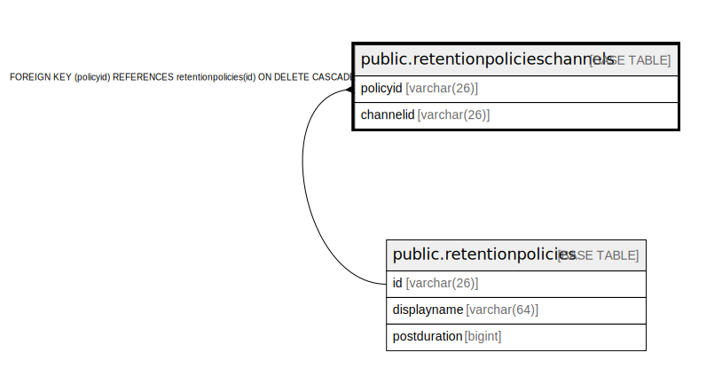

# public.retentionpolicieschannels

## 概要

## カラム一覧

| 名前        | タイプ         | デフォルト値       | NULL許可   | 子テーブル      | 親テーブル                                                   | コメント     |
| --------- | ----------- | ------------ | -------- | ---------- | ------------------------------------------------------- | -------- |
| policyid  | varchar(26) |              | true     |            | [public.retentionpolicies](public.retentionpolicies.md) |          |
| channelid | varchar(26) |              | false    |            |                                                         |          |

## 制約一覧

| 名前                                             | タイプ         | 定義                                                                        |
| ---------------------------------------------- | ----------- | ------------------------------------------------------------------------- |
| fk_retentionpolicieschannels_retentionpolicies | FOREIGN KEY | FOREIGN KEY (policyid) REFERENCES retentionpolicies(id) ON DELETE CASCADE |
| retentionpolicieschannels_pkey                 | PRIMARY KEY | PRIMARY KEY (channelid)                                                   |

## INDEX一覧

| 名前                                     | 定義                                                                                                             |
| -------------------------------------- | -------------------------------------------------------------------------------------------------------------- |
| retentionpolicieschannels_pkey         | CREATE UNIQUE INDEX retentionpolicieschannels_pkey ON public.retentionpolicieschannels USING btree (channelid) |
| idx_retentionpolicieschannels_policyid | CREATE INDEX idx_retentionpolicieschannels_policyid ON public.retentionpolicieschannels USING btree (policyid) |

## ER図

---

> Generated by [tbls](https://github.com/k1LoW/tbls)
