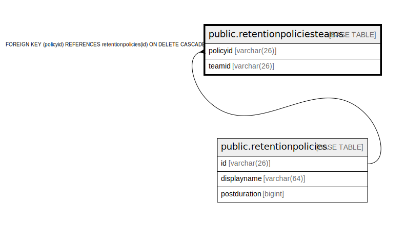

# public.retentionpoliciesteams

## 概要

## カラム一覧

| 名前       | タイプ         | デフォルト値       | NULL許可   | 子テーブル      | 親テーブル                                                   | コメント     |
| -------- | ----------- | ------------ | -------- | ---------- | ------------------------------------------------------- | -------- |
| policyid | varchar(26) |              | true     |            | [public.retentionpolicies](public.retentionpolicies.md) |          |
| teamid   | varchar(26) |              | false    |            |                                                         |          |

## 制約一覧

| 名前                                          | タイプ         | 定義                                                                        |
| ------------------------------------------- | ----------- | ------------------------------------------------------------------------- |
| fk_retentionpoliciesteams_retentionpolicies | FOREIGN KEY | FOREIGN KEY (policyid) REFERENCES retentionpolicies(id) ON DELETE CASCADE |
| retentionpoliciesteams_pkey                 | PRIMARY KEY | PRIMARY KEY (teamid)                                                      |

## INDEX一覧

| 名前                                  | 定義                                                                                                       |
| ----------------------------------- | -------------------------------------------------------------------------------------------------------- |
| retentionpoliciesteams_pkey         | CREATE UNIQUE INDEX retentionpoliciesteams_pkey ON public.retentionpoliciesteams USING btree (teamid)    |
| idx_retentionpoliciesteams_policyid | CREATE INDEX idx_retentionpoliciesteams_policyid ON public.retentionpoliciesteams USING btree (policyid) |

## ER図

---

> Generated by [tbls](https://github.com/k1LoW/tbls)
