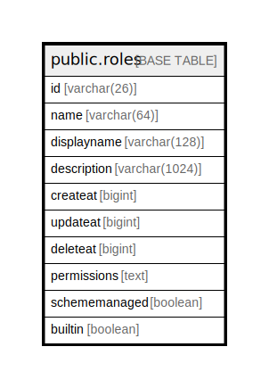

# public.roles

## 概要

## カラム一覧

| 名前            | タイプ           | デフォルト値       | NULL許可   | 子テーブル      | 親テーブル      | コメント     |
| ------------- | ------------- | ------------ | -------- | ---------- | ---------- | -------- |
| id            | varchar(26)   |              | false    |            |            |          |
| name          | varchar(64)   |              | true     |            |            |          |
| displayname   | varchar(128)  |              | true     |            |            |          |
| description   | varchar(1024) |              | true     |            |            |          |
| createat      | bigint        |              | true     |            |            |          |
| updateat      | bigint        |              | true     |            |            |          |
| deleteat      | bigint        |              | true     |            |            |          |
| permissions   | text          |              | true     |            |            |          |
| schememanaged | boolean       |              | true     |            |            |          |
| builtin       | boolean       |              | true     |            |            |          |

## 制約一覧

| 名前             | タイプ         | 定義               |
| -------------- | ----------- | ---------------- |
| roles_pkey     | PRIMARY KEY | PRIMARY KEY (id) |
| roles_name_key | UNIQUE      | UNIQUE (name)    |

## INDEX一覧

| 名前             | 定義                                                                    |
| -------------- | --------------------------------------------------------------------- |
| roles_pkey     | CREATE UNIQUE INDEX roles_pkey ON public.roles USING btree (id)       |
| roles_name_key | CREATE UNIQUE INDEX roles_name_key ON public.roles USING btree (name) |

## ER図

---

> Generated by [tbls](https://github.com/k1LoW/tbls)
