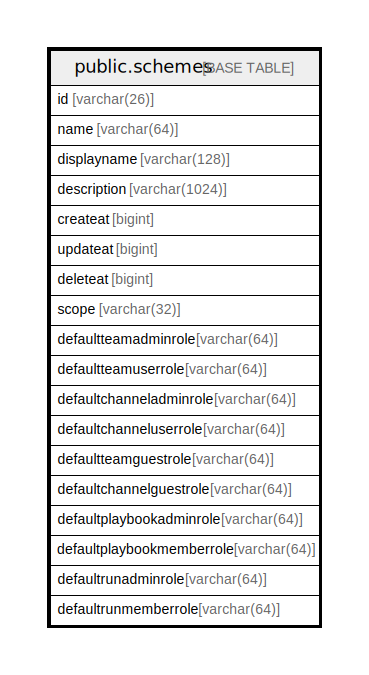

# public.schemes

## 概要

## カラム一覧

| 名前                        | タイプ           | デフォルト値                | NULL許可   | 子テーブル      | 親テーブル      | コメント     |
| ------------------------- | ------------- | --------------------- | -------- | ---------- | ---------- | -------- |
| id                        | varchar(26)   |                       | false    |            |            |          |
| name                      | varchar(64)   |                       | true     |            |            |          |
| displayname               | varchar(128)  |                       | true     |            |            |          |
| description               | varchar(1024) |                       | true     |            |            |          |
| createat                  | bigint        |                       | true     |            |            |          |
| updateat                  | bigint        |                       | true     |            |            |          |
| deleteat                  | bigint        |                       | true     |            |            |          |
| scope                     | varchar(32)   |                       | true     |            |            |          |
| defaultteamadminrole      | varchar(64)   |                       | true     |            |            |          |
| defaultteamuserrole       | varchar(64)   |                       | true     |            |            |          |
| defaultchanneladminrole   | varchar(64)   |                       | true     |            |            |          |
| defaultchanneluserrole    | varchar(64)   |                       | true     |            |            |          |
| defaultteamguestrole      | varchar(64)   |                       | true     |            |            |          |
| defaultchannelguestrole   | varchar(64)   |                       | true     |            |            |          |
| defaultplaybookadminrole  | varchar(64)   | ''::character varying | true     |            |            |          |
| defaultplaybookmemberrole | varchar(64)   | ''::character varying | true     |            |            |          |
| defaultrunadminrole       | varchar(64)   | ''::character varying | true     |            |            |          |
| defaultrunmemberrole      | varchar(64)   | ''::character varying | true     |            |            |          |

## 制約一覧

| 名前               | タイプ         | 定義               |
| ---------------- | ----------- | ---------------- |
| schemes_pkey     | PRIMARY KEY | PRIMARY KEY (id) |
| schemes_name_key | UNIQUE      | UNIQUE (name)    |

## INDEX一覧

| 名前                             | 定義                                                                                                  |
| ------------------------------ | --------------------------------------------------------------------------------------------------- |
| schemes_pkey                   | CREATE UNIQUE INDEX schemes_pkey ON public.schemes USING btree (id)                                 |
| schemes_name_key               | CREATE UNIQUE INDEX schemes_name_key ON public.schemes USING btree (name)                           |
| idx_schemes_channel_guest_role | CREATE INDEX idx_schemes_channel_guest_role ON public.schemes USING btree (defaultchannelguestrole) |
| idx_schemes_channel_user_role  | CREATE INDEX idx_schemes_channel_user_role ON public.schemes USING btree (defaultchanneluserrole)   |
| idx_schemes_channel_admin_role | CREATE INDEX idx_schemes_channel_admin_role ON public.schemes USING btree (defaultchanneladminrole) |

## ER図

---

> Generated by [tbls](https://github.com/k1LoW/tbls)
