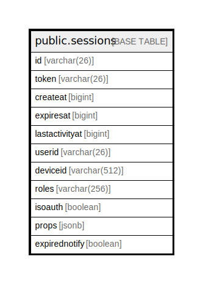

# public.sessions

## 概要

## カラム一覧

| 名前             | タイプ          | デフォルト値       | NULL許可   | 子テーブル      | 親テーブル      | コメント     |
| -------------- | ------------ | ------------ | -------- | ---------- | ---------- | -------- |
| id             | varchar(26)  |              | false    |            |            |          |
| token          | varchar(26)  |              | true     |            |            |          |
| createat       | bigint       |              | true     |            |            |          |
| expiresat      | bigint       |              | true     |            |            |          |
| lastactivityat | bigint       |              | true     |            |            |          |
| userid         | varchar(26)  |              | true     |            |            |          |
| deviceid       | varchar(512) |              | true     |            |            |          |
| roles          | varchar(256) |              | true     |            |            |          |
| isoauth        | boolean      |              | true     |            |            |          |
| props          | jsonb        |              | true     |            |            |          |
| expirednotify  | boolean      |              | true     |            |            |          |

## 制約一覧

| 名前            | タイプ         | 定義               |
| ------------- | ----------- | ---------------- |
| sessions_pkey | PRIMARY KEY | PRIMARY KEY (id) |

## INDEX一覧

| 名前                            | 定義                                                                                         |
| ----------------------------- | ------------------------------------------------------------------------------------------ |
| sessions_pkey                 | CREATE UNIQUE INDEX sessions_pkey ON public.sessions USING btree (id)                      |
| idx_sessions_user_id          | CREATE INDEX idx_sessions_user_id ON public.sessions USING btree (userid)                  |
| idx_sessions_token            | CREATE INDEX idx_sessions_token ON public.sessions USING btree (token)                     |
| idx_sessions_expires_at       | CREATE INDEX idx_sessions_expires_at ON public.sessions USING btree (expiresat)            |
| idx_sessions_create_at        | CREATE INDEX idx_sessions_create_at ON public.sessions USING btree (createat)              |
| idx_sessions_last_activity_at | CREATE INDEX idx_sessions_last_activity_at ON public.sessions USING btree (lastactivityat) |

## ER図

---

> Generated by [tbls](https://github.com/k1LoW/tbls)
