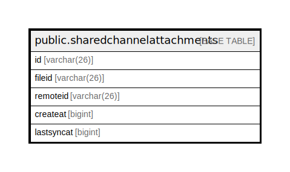

# public.sharedchannelattachments

## 概要

## カラム一覧

| 名前         | タイプ         | デフォルト値       | NULL許可   | 子テーブル      | 親テーブル      | コメント     |
| ---------- | ----------- | ------------ | -------- | ---------- | ---------- | -------- |
| id         | varchar(26) |              | false    |            |            |          |
| fileid     | varchar(26) |              | true     |            |            |          |
| remoteid   | varchar(26) |              | true     |            |            |          |
| createat   | bigint      |              | true     |            |            |          |
| lastsyncat | bigint      |              | true     |            |            |          |

## 制約一覧

| 名前                                           | タイプ         | 定義                        |
| -------------------------------------------- | ----------- | ------------------------- |
| sharedchannelattachments_pkey                | PRIMARY KEY | PRIMARY KEY (id)          |
| sharedchannelattachments_fileid_remoteid_key | UNIQUE      | UNIQUE (fileid, remoteid) |

## INDEX一覧

| 名前                                           | 定義                                                                                                                                 |
| -------------------------------------------- | ---------------------------------------------------------------------------------------------------------------------------------- |
| sharedchannelattachments_pkey                | CREATE UNIQUE INDEX sharedchannelattachments_pkey ON public.sharedchannelattachments USING btree (id)                              |
| sharedchannelattachments_fileid_remoteid_key | CREATE UNIQUE INDEX sharedchannelattachments_fileid_remoteid_key ON public.sharedchannelattachments USING btree (fileid, remoteid) |

## ER図

---

> Generated by [tbls](https://github.com/k1LoW/tbls)
