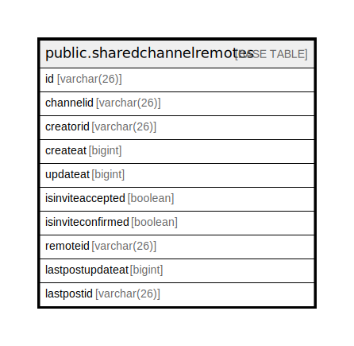

# public.sharedchannelremotes

## 概要

## カラム一覧

| 名前                | タイプ         | デフォルト値       | NULL許可   | 子テーブル      | 親テーブル      | コメント     |
| ----------------- | ----------- | ------------ | -------- | ---------- | ---------- | -------- |
| id                | varchar(26) |              | false    |            |            |          |
| channelid         | varchar(26) |              | false    |            |            |          |
| creatorid         | varchar(26) |              | true     |            |            |          |
| createat          | bigint      |              | true     |            |            |          |
| updateat          | bigint      |              | true     |            |            |          |
| isinviteaccepted  | boolean     |              | true     |            |            |          |
| isinviteconfirmed | boolean     |              | true     |            |            |          |
| remoteid          | varchar(26) |              | true     |            |            |          |
| lastpostupdateat  | bigint      |              | true     |            |            |          |
| lastpostid        | varchar(26) |              | true     |            |            |          |

## 制約一覧

| 名前                                          | タイプ         | 定義                           |
| ------------------------------------------- | ----------- | ---------------------------- |
| sharedchannelremotes_pkey                   | PRIMARY KEY | PRIMARY KEY (id, channelid)  |
| sharedchannelremotes_channelid_remoteid_key | UNIQUE      | UNIQUE (channelid, remoteid) |

## INDEX一覧

| 名前                                          | 定義                                                                                                                               |
| ------------------------------------------- | -------------------------------------------------------------------------------------------------------------------------------- |
| sharedchannelremotes_pkey                   | CREATE UNIQUE INDEX sharedchannelremotes_pkey ON public.sharedchannelremotes USING btree (id, channelid)                         |
| sharedchannelremotes_channelid_remoteid_key | CREATE UNIQUE INDEX sharedchannelremotes_channelid_remoteid_key ON public.sharedchannelremotes USING btree (channelid, remoteid) |

## ER図

---

> Generated by [tbls](https://github.com/k1LoW/tbls)
