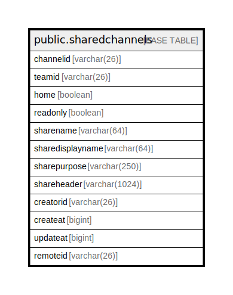

# public.sharedchannels

## 概要

## カラム一覧

| 名前               | タイプ           | デフォルト値       | NULL許可   | 子テーブル      | 親テーブル      | コメント     |
| ---------------- | ------------- | ------------ | -------- | ---------- | ---------- | -------- |
| channelid        | varchar(26)   |              | false    |            |            |          |
| teamid           | varchar(26)   |              | true     |            |            |          |
| home             | boolean       |              | true     |            |            |          |
| readonly         | boolean       |              | true     |            |            |          |
| sharename        | varchar(64)   |              | true     |            |            |          |
| sharedisplayname | varchar(64)   |              | true     |            |            |          |
| sharepurpose     | varchar(250)  |              | true     |            |            |          |
| shareheader      | varchar(1024) |              | true     |            |            |          |
| creatorid        | varchar(26)   |              | true     |            |            |          |
| createat         | bigint        |              | true     |            |            |          |
| updateat         | bigint        |              | true     |            |            |          |
| remoteid         | varchar(26)   |              | true     |            |            |          |

## 制約一覧

| 名前                                  | タイプ         | 定義                         |
| ----------------------------------- | ----------- | -------------------------- |
| sharedchannels_pkey                 | PRIMARY KEY | PRIMARY KEY (channelid)    |
| sharedchannels_sharename_teamid_key | UNIQUE      | UNIQUE (sharename, teamid) |

## INDEX一覧

| 名前                                  | 定義                                                                                                               |
| ----------------------------------- | ---------------------------------------------------------------------------------------------------------------- |
| sharedchannels_pkey                 | CREATE UNIQUE INDEX sharedchannels_pkey ON public.sharedchannels USING btree (channelid)                         |
| sharedchannels_sharename_teamid_key | CREATE UNIQUE INDEX sharedchannels_sharename_teamid_key ON public.sharedchannels USING btree (sharename, teamid) |

## ER図

---

> Generated by [tbls](https://github.com/k1LoW/tbls)
