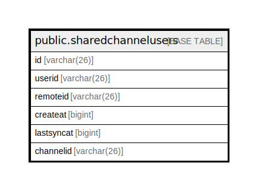

# public.sharedchannelusers

## 概要

## カラム一覧

| 名前         | タイプ         | デフォルト値       | NULL許可   | 子テーブル      | 親テーブル      | コメント     |
| ---------- | ----------- | ------------ | -------- | ---------- | ---------- | -------- |
| id         | varchar(26) |              | false    |            |            |          |
| userid     | varchar(26) |              | true     |            |            |          |
| remoteid   | varchar(26) |              | true     |            |            |          |
| createat   | bigint      |              | true     |            |            |          |
| lastsyncat | bigint      |              | true     |            |            |          |
| channelid  | varchar(26) |              | true     |            |            |          |

## 制約一覧

| 名前                                               | タイプ         | 定義                                   |
| ------------------------------------------------ | ----------- | ------------------------------------ |
| sharedchannelusers_pkey                          | PRIMARY KEY | PRIMARY KEY (id)                     |
| sharedchannelusers_userid_channelid_remoteid_key | UNIQUE      | UNIQUE (userid, channelid, remoteid) |

## INDEX一覧

| 名前                                               | 定義                                                                                                                                          |
| ------------------------------------------------ | ------------------------------------------------------------------------------------------------------------------------------------------- |
| sharedchannelusers_pkey                          | CREATE UNIQUE INDEX sharedchannelusers_pkey ON public.sharedchannelusers USING btree (id)                                                   |
| sharedchannelusers_userid_channelid_remoteid_key | CREATE UNIQUE INDEX sharedchannelusers_userid_channelid_remoteid_key ON public.sharedchannelusers USING btree (userid, channelid, remoteid) |
| idx_sharedchannelusers_remote_id                 | CREATE INDEX idx_sharedchannelusers_remote_id ON public.sharedchannelusers USING btree (remoteid)                                           |

## ER図

---

> Generated by [tbls](https://github.com/k1LoW/tbls)
