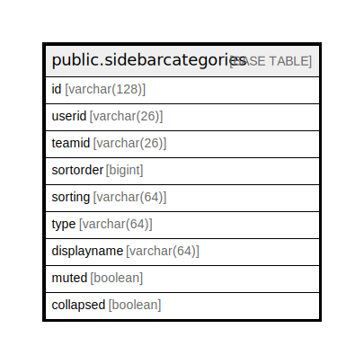

# public.sidebarcategories

## 概要

## カラム一覧

| 名前          | タイプ          | デフォルト値       | NULL許可   | 子テーブル      | 親テーブル      | コメント     |
| ----------- | ------------ | ------------ | -------- | ---------- | ---------- | -------- |
| id          | varchar(128) |              | false    |            |            |          |
| userid      | varchar(26)  |              | true     |            |            |          |
| teamid      | varchar(26)  |              | true     |            |            |          |
| sortorder   | bigint       |              | true     |            |            |          |
| sorting     | varchar(64)  |              | true     |            |            |          |
| type        | varchar(64)  |              | true     |            |            |          |
| displayname | varchar(64)  |              | true     |            |            |          |
| muted       | boolean      |              | true     |            |            |          |
| collapsed   | boolean      |              | true     |            |            |          |

## 制約一覧

| 名前                     | タイプ         | 定義               |
| ---------------------- | ----------- | ---------------- |
| sidebarcategories_pkey | PRIMARY KEY | PRIMARY KEY (id) |

## INDEX一覧

| 名前                                  | 定義                                                                                                        |
| ----------------------------------- | --------------------------------------------------------------------------------------------------------- |
| sidebarcategories_pkey              | CREATE UNIQUE INDEX sidebarcategories_pkey ON public.sidebarcategories USING btree (id)                   |
| idx_sidebarcategories_userid_teamid | CREATE INDEX idx_sidebarcategories_userid_teamid ON public.sidebarcategories USING btree (userid, teamid) |

## ER図

---

> Generated by [tbls](https://github.com/k1LoW/tbls)
