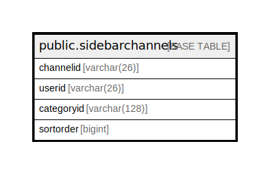

# public.sidebarchannels

## 概要

## カラム一覧

| 名前         | タイプ          | デフォルト値       | NULL許可   | 子テーブル      | 親テーブル      | コメント     |
| ---------- | ------------ | ------------ | -------- | ---------- | ---------- | -------- |
| channelid  | varchar(26)  |              | false    |            |            |          |
| userid     | varchar(26)  |              | false    |            |            |          |
| categoryid | varchar(128) |              | false    |            |            |          |
| sortorder  | bigint       |              | true     |            |            |          |

## 制約一覧

| 名前                   | タイプ         | 定義                                          |
| -------------------- | ----------- | ------------------------------------------- |
| sidebarchannels_pkey | PRIMARY KEY | PRIMARY KEY (channelid, userid, categoryid) |

## INDEX一覧

| 名前                   | 定義                                                                                                             |
| -------------------- | -------------------------------------------------------------------------------------------------------------- |
| sidebarchannels_pkey | CREATE UNIQUE INDEX sidebarchannels_pkey ON public.sidebarchannels USING btree (channelid, userid, categoryid) |

## ER図

---

> Generated by [tbls](https://github.com/k1LoW/tbls)
