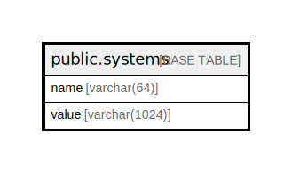

# public.systems

## 概要

## カラム一覧

| 名前    | タイプ           | デフォルト値       | NULL許可   | 子テーブル      | 親テーブル      | コメント     |
| ----- | ------------- | ------------ | -------- | ---------- | ---------- | -------- |
| name  | varchar(64)   |              | false    |            |            |          |
| value | varchar(1024) |              | true     |            |            |          |

## 制約一覧

| 名前           | タイプ         | 定義                 |
| ------------ | ----------- | ------------------ |
| systems_pkey | PRIMARY KEY | PRIMARY KEY (name) |

## INDEX一覧

| 名前           | 定義                                                                    |
| ------------ | --------------------------------------------------------------------- |
| systems_pkey | CREATE UNIQUE INDEX systems_pkey ON public.systems USING btree (name) |

## ER図

---

> Generated by [tbls](https://github.com/k1LoW/tbls)
