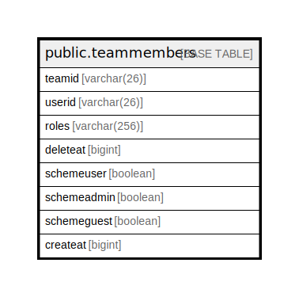

# public.teammembers

## 概要

## カラム一覧

| 名前          | タイプ          | デフォルト値       | NULL許可   | 子テーブル      | 親テーブル      | コメント     |
| ----------- | ------------ | ------------ | -------- | ---------- | ---------- | -------- |
| teamid      | varchar(26)  |              | false    |            |            |          |
| userid      | varchar(26)  |              | false    |            |            |          |
| roles       | varchar(256) |              | true     |            |            |          |
| deleteat    | bigint       |              | true     |            |            |          |
| schemeuser  | boolean      |              | true     |            |            |          |
| schemeadmin | boolean      |              | true     |            |            |          |
| schemeguest | boolean      |              | true     |            |            |          |
| createat    | bigint       | 0            | true     |            |            |          |

## 制約一覧

| 名前               | タイプ         | 定義                           |
| ---------------- | ----------- | ---------------------------- |
| teammembers_pkey | PRIMARY KEY | PRIMARY KEY (teamid, userid) |

## INDEX一覧

| 名前                        | 定義                                                                                      |
| ------------------------- | --------------------------------------------------------------------------------------- |
| teammembers_pkey          | CREATE UNIQUE INDEX teammembers_pkey ON public.teammembers USING btree (teamid, userid) |
| idx_teammembers_user_id   | CREATE INDEX idx_teammembers_user_id ON public.teammembers USING btree (userid)         |
| idx_teammembers_delete_at | CREATE INDEX idx_teammembers_delete_at ON public.teammembers USING btree (deleteat)     |
| idx_teammembers_createat  | CREATE INDEX idx_teammembers_createat ON public.teammembers USING btree (createat)      |

## ER図

---

> Generated by [tbls](https://github.com/k1LoW/tbls)
