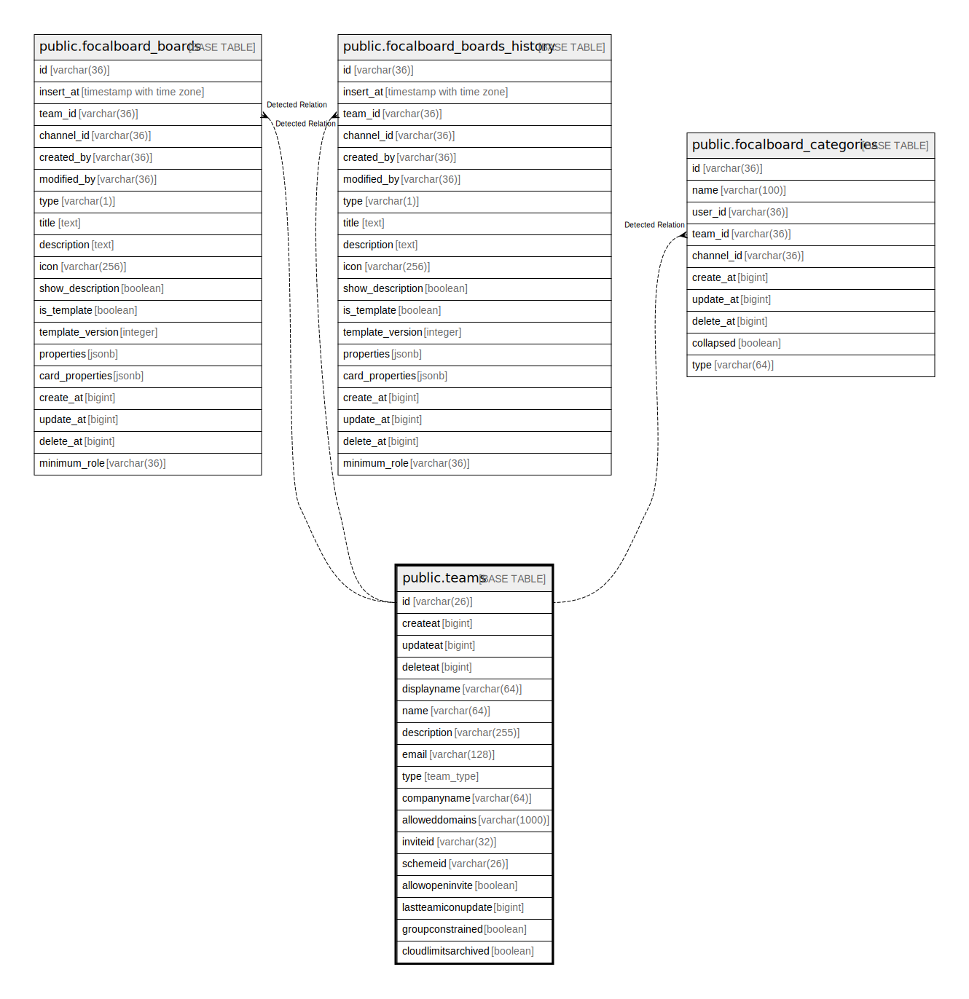

# public.teams

## 概要

## カラム一覧

| 名前                  | タイプ           | デフォルト値       | NULL許可   | 子テーブル                                                                                                                                                                                           | 親テーブル      | コメント     |
| ------------------- | ------------- | ------------ | -------- | ----------------------------------------------------------------------------------------------------------------------------------------------------------------------------------------------- | ---------- | -------- |
| id                  | varchar(26)   |              | false    | [public.focalboard_boards](public.focalboard_boards.md) [public.focalboard_boards_history](public.focalboard_boards_history.md) [public.focalboard_categories](public.focalboard_categories.md) |            |          |
| createat            | bigint        |              | true     |                                                                                                                                                                                                 |            |          |
| updateat            | bigint        |              | true     |                                                                                                                                                                                                 |            |          |
| deleteat            | bigint        |              | true     |                                                                                                                                                                                                 |            |          |
| displayname         | varchar(64)   |              | true     |                                                                                                                                                                                                 |            |          |
| name                | varchar(64)   |              | true     |                                                                                                                                                                                                 |            |          |
| description         | varchar(255)  |              | true     |                                                                                                                                                                                                 |            |          |
| email               | varchar(128)  |              | true     |                                                                                                                                                                                                 |            |          |
| type                | team_type     |              | true     |                                                                                                                                                                                                 |            |          |
| companyname         | varchar(64)   |              | true     |                                                                                                                                                                                                 |            |          |
| alloweddomains      | varchar(1000) |              | true     |                                                                                                                                                                                                 |            |          |
| inviteid            | varchar(32)   |              | true     |                                                                                                                                                                                                 |            |          |
| schemeid            | varchar(26)   |              | true     |                                                                                                                                                                                                 |            |          |
| allowopeninvite     | boolean       |              | true     |                                                                                                                                                                                                 |            |          |
| lastteamiconupdate  | bigint        |              | true     |                                                                                                                                                                                                 |            |          |
| groupconstrained    | boolean       |              | true     |                                                                                                                                                                                                 |            |          |
| cloudlimitsarchived | boolean       | false        | false    |                                                                                                                                                                                                 |            |          |

## 制約一覧

| 名前             | タイプ         | 定義               |
| -------------- | ----------- | ---------------- |
| teams_pkey     | PRIMARY KEY | PRIMARY KEY (id) |
| teams_name_key | UNIQUE      | UNIQUE (name)    |

## INDEX一覧

| 名前                  | 定義                                                                      |
| ------------------- | ----------------------------------------------------------------------- |
| teams_pkey          | CREATE UNIQUE INDEX teams_pkey ON public.teams USING btree (id)         |
| teams_name_key      | CREATE UNIQUE INDEX teams_name_key ON public.teams USING btree (name)   |
| idx_teams_invite_id | CREATE INDEX idx_teams_invite_id ON public.teams USING btree (inviteid) |
| idx_teams_update_at | CREATE INDEX idx_teams_update_at ON public.teams USING btree (updateat) |
| idx_teams_create_at | CREATE INDEX idx_teams_create_at ON public.teams USING btree (createat) |
| idx_teams_delete_at | CREATE INDEX idx_teams_delete_at ON public.teams USING btree (deleteat) |
| idx_teams_scheme_id | CREATE INDEX idx_teams_scheme_id ON public.teams USING btree (schemeid) |

## ER図

---

> Generated by [tbls](https://github.com/k1LoW/tbls)
