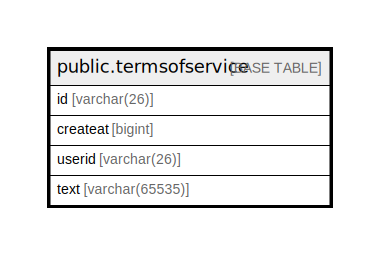

# public.termsofservice

## 概要

## カラム一覧

| 名前       | タイプ            | デフォルト値       | NULL許可   | 子テーブル      | 親テーブル      | コメント     |
| -------- | -------------- | ------------ | -------- | ---------- | ---------- | -------- |
| id       | varchar(26)    |              | false    |            |            |          |
| createat | bigint         |              | true     |            |            |          |
| userid   | varchar(26)    |              | true     |            |            |          |
| text     | varchar(65535) |              | true     |            |            |          |

## 制約一覧

| 名前                  | タイプ         | 定義               |
| ------------------- | ----------- | ---------------- |
| termsofservice_pkey | PRIMARY KEY | PRIMARY KEY (id) |

## INDEX一覧

| 名前                  | 定義                                                                                |
| ------------------- | --------------------------------------------------------------------------------- |
| termsofservice_pkey | CREATE UNIQUE INDEX termsofservice_pkey ON public.termsofservice USING btree (id) |

## ER図

---

> Generated by [tbls](https://github.com/k1LoW/tbls)
