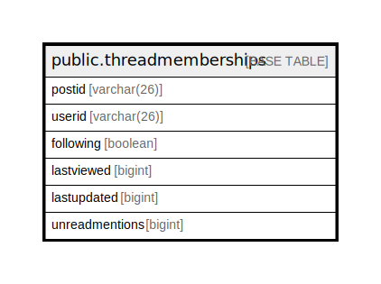

# public.threadmemberships

## 概要

## カラム一覧

| 名前             | タイプ         | デフォルト値       | NULL許可   | 子テーブル      | 親テーブル      | コメント     |
| -------------- | ----------- | ------------ | -------- | ---------- | ---------- | -------- |
| postid         | varchar(26) |              | false    |            |            |          |
| userid         | varchar(26) |              | false    |            |            |          |
| following      | boolean     |              | true     |            |            |          |
| lastviewed     | bigint      |              | true     |            |            |          |
| lastupdated    | bigint      |              | true     |            |            |          |
| unreadmentions | bigint      |              | true     |            |            |          |

## 制約一覧

| 名前                     | タイプ         | 定義                           |
| ---------------------- | ----------- | ---------------------------- |
| threadmemberships_pkey | PRIMARY KEY | PRIMARY KEY (postid, userid) |

## INDEX一覧

| 名前                                    | 定義                                                                                                       |
| ------------------------------------- | -------------------------------------------------------------------------------------------------------- |
| threadmemberships_pkey                | CREATE UNIQUE INDEX threadmemberships_pkey ON public.threadmemberships USING btree (postid, userid)      |
| idx_thread_memberships_last_update_at | CREATE INDEX idx_thread_memberships_last_update_at ON public.threadmemberships USING btree (lastupdated) |
| idx_thread_memberships_last_view_at   | CREATE INDEX idx_thread_memberships_last_view_at ON public.threadmemberships USING btree (lastviewed)    |
| idx_thread_memberships_user_id        | CREATE INDEX idx_thread_memberships_user_id ON public.threadmemberships USING btree (userid)             |

## ER図

---

> Generated by [tbls](https://github.com/k1LoW/tbls)
