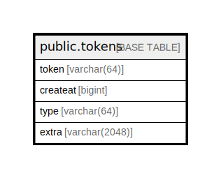

# public.tokens

## 概要

## カラム一覧

| 名前       | タイプ           | デフォルト値       | NULL許可   | 子テーブル      | 親テーブル      | コメント     |
| -------- | ------------- | ------------ | -------- | ---------- | ---------- | -------- |
| token    | varchar(64)   |              | false    |            |            |          |
| createat | bigint        |              | true     |            |            |          |
| type     | varchar(64)   |              | true     |            |            |          |
| extra    | varchar(2048) |              | true     |            |            |          |

## 制約一覧

| 名前          | タイプ         | 定義                  |
| ----------- | ----------- | ------------------- |
| tokens_pkey | PRIMARY KEY | PRIMARY KEY (token) |

## INDEX一覧

| 名前          | 定義                                                                   |
| ----------- | -------------------------------------------------------------------- |
| tokens_pkey | CREATE UNIQUE INDEX tokens_pkey ON public.tokens USING btree (token) |

## ER図

---

> Generated by [tbls](https://github.com/k1LoW/tbls)
