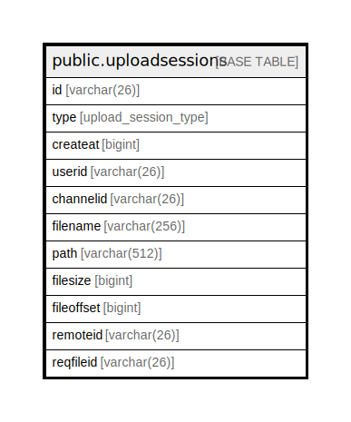

# public.uploadsessions

## 概要

## カラム一覧

| 名前         | タイプ                 | デフォルト値       | NULL許可   | 子テーブル      | 親テーブル      | コメント     |
| ---------- | ------------------- | ------------ | -------- | ---------- | ---------- | -------- |
| id         | varchar(26)         |              | false    |            |            |          |
| type       | upload_session_type |              | true     |            |            |          |
| createat   | bigint              |              | true     |            |            |          |
| userid     | varchar(26)         |              | true     |            |            |          |
| channelid  | varchar(26)         |              | true     |            |            |          |
| filename   | varchar(256)        |              | true     |            |            |          |
| path       | varchar(512)        |              | true     |            |            |          |
| filesize   | bigint              |              | true     |            |            |          |
| fileoffset | bigint              |              | true     |            |            |          |
| remoteid   | varchar(26)         |              | true     |            |            |          |
| reqfileid  | varchar(26)         |              | true     |            |            |          |

## 制約一覧

| 名前                  | タイプ         | 定義               |
| ------------------- | ----------- | ---------------- |
| uploadsessions_pkey | PRIMARY KEY | PRIMARY KEY (id) |

## INDEX一覧

| 名前                           | 定義                                                                                        |
| ---------------------------- | ----------------------------------------------------------------------------------------- |
| uploadsessions_pkey          | CREATE UNIQUE INDEX uploadsessions_pkey ON public.uploadsessions USING btree (id)         |
| idx_uploadsessions_user_id   | CREATE INDEX idx_uploadsessions_user_id ON public.uploadsessions USING btree (userid)     |
| idx_uploadsessions_create_at | CREATE INDEX idx_uploadsessions_create_at ON public.uploadsessions USING btree (createat) |
| idx_uploadsessions_type      | CREATE INDEX idx_uploadsessions_type ON public.uploadsessions USING btree (type)          |

## ER図

---

> Generated by [tbls](https://github.com/k1LoW/tbls)
