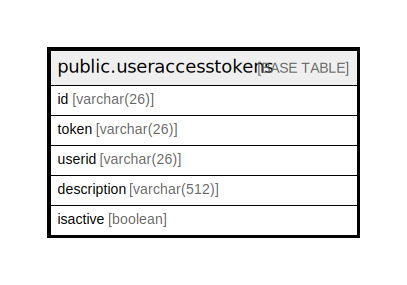

# public.useraccesstokens

## 概要

## カラム一覧

| 名前          | タイプ          | デフォルト値       | NULL許可   | 子テーブル      | 親テーブル      | コメント     |
| ----------- | ------------ | ------------ | -------- | ---------- | ---------- | -------- |
| id          | varchar(26)  |              | false    |            |            |          |
| token       | varchar(26)  |              | true     |            |            |          |
| userid      | varchar(26)  |              | true     |            |            |          |
| description | varchar(512) |              | true     |            |            |          |
| isactive    | boolean      |              | true     |            |            |          |

## 制約一覧

| 名前                         | タイプ         | 定義               |
| -------------------------- | ----------- | ---------------- |
| useraccesstokens_pkey      | PRIMARY KEY | PRIMARY KEY (id) |
| useraccesstokens_token_key | UNIQUE      | UNIQUE (token)   |

## INDEX一覧

| 名前                             | 定義                                                                                            |
| ------------------------------ | --------------------------------------------------------------------------------------------- |
| useraccesstokens_pkey          | CREATE UNIQUE INDEX useraccesstokens_pkey ON public.useraccesstokens USING btree (id)         |
| useraccesstokens_token_key     | CREATE UNIQUE INDEX useraccesstokens_token_key ON public.useraccesstokens USING btree (token) |
| idx_user_access_tokens_user_id | CREATE INDEX idx_user_access_tokens_user_id ON public.useraccesstokens USING btree (userid)   |

## ER図

---

> Generated by [tbls](https://github.com/k1LoW/tbls)
