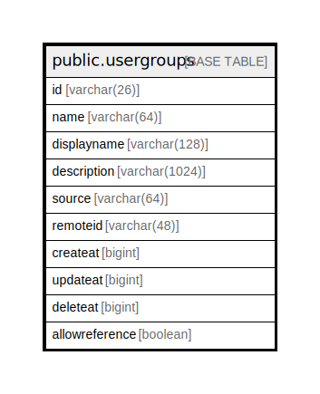

# public.usergroups

## 概要

## カラム一覧

| 名前             | タイプ           | デフォルト値       | NULL許可   | 子テーブル      | 親テーブル      | コメント     |
| -------------- | ------------- | ------------ | -------- | ---------- | ---------- | -------- |
| id             | varchar(26)   |              | false    |            |            |          |
| name           | varchar(64)   |              | true     |            |            |          |
| displayname    | varchar(128)  |              | true     |            |            |          |
| description    | varchar(1024) |              | true     |            |            |          |
| source         | varchar(64)   |              | true     |            |            |          |
| remoteid       | varchar(48)   |              | true     |            |            |          |
| createat       | bigint        |              | true     |            |            |          |
| updateat       | bigint        |              | true     |            |            |          |
| deleteat       | bigint        |              | true     |            |            |          |
| allowreference | boolean       |              | true     |            |            |          |

## 制約一覧

| 名前                             | タイプ         | 定義                        |
| ------------------------------ | ----------- | ------------------------- |
| usergroups_pkey                | PRIMARY KEY | PRIMARY KEY (id)          |
| usergroups_name_key            | UNIQUE      | UNIQUE (name)             |
| usergroups_source_remoteid_key | UNIQUE      | UNIQUE (source, remoteid) |

## INDEX一覧

| 名前                             | 定義                                                                                                     |
| ------------------------------ | ------------------------------------------------------------------------------------------------------ |
| usergroups_pkey                | CREATE UNIQUE INDEX usergroups_pkey ON public.usergroups USING btree (id)                              |
| usergroups_name_key            | CREATE UNIQUE INDEX usergroups_name_key ON public.usergroups USING btree (name)                        |
| usergroups_source_remoteid_key | CREATE UNIQUE INDEX usergroups_source_remoteid_key ON public.usergroups USING btree (source, remoteid) |
| idx_usergroups_remote_id       | CREATE INDEX idx_usergroups_remote_id ON public.usergroups USING btree (remoteid)                      |
| idx_usergroups_delete_at       | CREATE INDEX idx_usergroups_delete_at ON public.usergroups USING btree (deleteat)                      |
| idx_usergroups_displayname     | CREATE INDEX idx_usergroups_displayname ON public.usergroups USING btree (displayname)                 |

## ER図

---

> Generated by [tbls](https://github.com/k1LoW/tbls)
