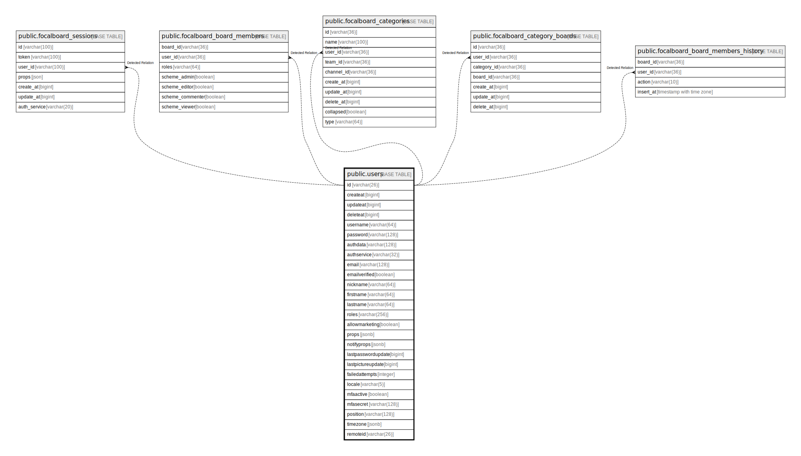

# public.users

## 概要

## カラム一覧

| 名前                 | タイプ          | デフォルト値       | NULL許可   | 子テーブル                                                                                                                                                                                                                                                                                                                                                             | 親テーブル      | コメント     |
| ------------------ | ------------ | ------------ | -------- | ----------------------------------------------------------------------------------------------------------------------------------------------------------------------------------------------------------------------------------------------------------------------------------------------------------------------------------------------------------------- | ---------- | -------- |
| id                 | varchar(26)  |              | false    | [public.focalboard_sessions](public.focalboard_sessions.md) [public.focalboard_board_members](public.focalboard_board_members.md) [public.focalboard_categories](public.focalboard_categories.md) [public.focalboard_category_boards](public.focalboard_category_boards.md) [public.focalboard_board_members_history](public.focalboard_board_members_history.md) |            |          |
| createat           | bigint       |              | true     |                                                                                                                                                                                                                                                                                                                                                                   |            |          |
| updateat           | bigint       |              | true     |                                                                                                                                                                                                                                                                                                                                                                   |            |          |
| deleteat           | bigint       |              | true     |                                                                                                                                                                                                                                                                                                                                                                   |            |          |
| username           | varchar(64)  |              | true     |                                                                                                                                                                                                                                                                                                                                                                   |            |          |
| password           | varchar(128) |              | true     |                                                                                                                                                                                                                                                                                                                                                                   |            |          |
| authdata           | varchar(128) |              | true     |                                                                                                                                                                                                                                                                                                                                                                   |            |          |
| authservice        | varchar(32)  |              | true     |                                                                                                                                                                                                                                                                                                                                                                   |            |          |
| email              | varchar(128) |              | true     |                                                                                                                                                                                                                                                                                                                                                                   |            |          |
| emailverified      | boolean      |              | true     |                                                                                                                                                                                                                                                                                                                                                                   |            |          |
| nickname           | varchar(64)  |              | true     |                                                                                                                                                                                                                                                                                                                                                                   |            |          |
| firstname          | varchar(64)  |              | true     |                                                                                                                                                                                                                                                                                                                                                                   |            |          |
| lastname           | varchar(64)  |              | true     |                                                                                                                                                                                                                                                                                                                                                                   |            |          |
| roles              | varchar(256) |              | true     |                                                                                                                                                                                                                                                                                                                                                                   |            |          |
| allowmarketing     | boolean      |              | true     |                                                                                                                                                                                                                                                                                                                                                                   |            |          |
| props              | jsonb        |              | true     |                                                                                                                                                                                                                                                                                                                                                                   |            |          |
| notifyprops        | jsonb        |              | true     |                                                                                                                                                                                                                                                                                                                                                                   |            |          |
| lastpasswordupdate | bigint       |              | true     |                                                                                                                                                                                                                                                                                                                                                                   |            |          |
| lastpictureupdate  | bigint       |              | true     |                                                                                                                                                                                                                                                                                                                                                                   |            |          |
| failedattempts     | integer      |              | true     |                                                                                                                                                                                                                                                                                                                                                                   |            |          |
| locale             | varchar(5)   |              | true     |                                                                                                                                                                                                                                                                                                                                                                   |            |          |
| mfaactive          | boolean      |              | true     |                                                                                                                                                                                                                                                                                                                                                                   |            |          |
| mfasecret          | varchar(128) |              | true     |                                                                                                                                                                                                                                                                                                                                                                   |            |          |
| position           | varchar(128) |              | true     |                                                                                                                                                                                                                                                                                                                                                                   |            |          |
| timezone           | jsonb        |              | true     |                                                                                                                                                                                                                                                                                                                                                                   |            |          |
| remoteid           | varchar(26)  |              | true     |                                                                                                                                                                                                                                                                                                                                                                   |            |          |

## 制約一覧

| 名前                 | タイプ         | 定義                |
| ------------------ | ----------- | ----------------- |
| users_pkey         | PRIMARY KEY | PRIMARY KEY (id)  |
| users_username_key | UNIQUE      | UNIQUE (username) |
| users_authdata_key | UNIQUE      | UNIQUE (authdata) |
| users_email_key    | UNIQUE      | UNIQUE (email)    |

## INDEX一覧

| 名前                                    | 定義                                                                                                                                                                                                                                                               |
| ------------------------------------- | ---------------------------------------------------------------------------------------------------------------------------------------------------------------------------------------------------------------------------------------------------------------- |
| users_pkey                            | CREATE UNIQUE INDEX users_pkey ON public.users USING btree (id)                                                                                                                                                                                                  |
| users_username_key                    | CREATE UNIQUE INDEX users_username_key ON public.users USING btree (username)                                                                                                                                                                                    |
| users_authdata_key                    | CREATE UNIQUE INDEX users_authdata_key ON public.users USING btree (authdata)                                                                                                                                                                                    |
| users_email_key                       | CREATE UNIQUE INDEX users_email_key ON public.users USING btree (email)                                                                                                                                                                                          |
| idx_users_update_at                   | CREATE INDEX idx_users_update_at ON public.users USING btree (updateat)                                                                                                                                                                                          |
| idx_users_create_at                   | CREATE INDEX idx_users_create_at ON public.users USING btree (createat)                                                                                                                                                                                          |
| idx_users_delete_at                   | CREATE INDEX idx_users_delete_at ON public.users USING btree (deleteat)                                                                                                                                                                                          |
| idx_users_email_lower_textpattern     | CREATE INDEX idx_users_email_lower_textpattern ON public.users USING btree (lower((email)::text) text_pattern_ops)                                                                                                                                               |
| idx_users_username_lower_textpattern  | CREATE INDEX idx_users_username_lower_textpattern ON public.users USING btree (lower((username)::text) text_pattern_ops)                                                                                                                                         |
| idx_users_nickname_lower_textpattern  | CREATE INDEX idx_users_nickname_lower_textpattern ON public.users USING btree (lower((nickname)::text) text_pattern_ops)                                                                                                                                         |
| idx_users_firstname_lower_textpattern | CREATE INDEX idx_users_firstname_lower_textpattern ON public.users USING btree (lower((firstname)::text) text_pattern_ops)                                                                                                                                       |
| idx_users_lastname_lower_textpattern  | CREATE INDEX idx_users_lastname_lower_textpattern ON public.users USING btree (lower((lastname)::text) text_pattern_ops)                                                                                                                                         |
| idx_users_all_txt                     | CREATE INDEX idx_users_all_txt ON public.users USING gin (to_tsvector('english'::regconfig, (((((((((username)::text || ' '::text) || (firstname)::text) || ' '::text) || (lastname)::text) || ' '::text) || (nickname)::text) || ' '::text) || (email)::text))) |
| idx_users_all_no_full_name_txt        | CREATE INDEX idx_users_all_no_full_name_txt ON public.users USING gin (to_tsvector('english'::regconfig, (((((username)::text || ' '::text) || (nickname)::text) || ' '::text) || (email)::text)))                                                               |
| idx_users_names_txt                   | CREATE INDEX idx_users_names_txt ON public.users USING gin (to_tsvector('english'::regconfig, (((((((username)::text || ' '::text) || (firstname)::text) || ' '::text) || (lastname)::text) || ' '::text) || (nickname)::text)))                                 |
| idx_users_names_no_full_name_txt      | CREATE INDEX idx_users_names_no_full_name_txt ON public.users USING gin (to_tsvector('english'::regconfig, (((username)::text || ' '::text) || (nickname)::text)))                                                                                               |

## ER図

---

> Generated by [tbls](https://github.com/k1LoW/tbls)
