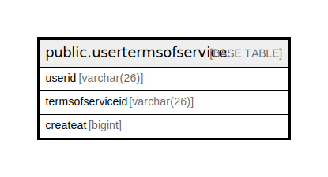

# public.usertermsofservice

## 概要

## カラム一覧

| 名前               | タイプ         | デフォルト値       | NULL許可   | 子テーブル      | 親テーブル      | コメント     |
| ---------------- | ----------- | ------------ | -------- | ---------- | ---------- | -------- |
| userid           | varchar(26) |              | false    |            |            |          |
| termsofserviceid | varchar(26) |              | true     |            |            |          |
| createat         | bigint      |              | true     |            |            |          |

## 制約一覧

| 名前                      | タイプ         | 定義                   |
| ----------------------- | ----------- | -------------------- |
| usertermsofservice_pkey | PRIMARY KEY | PRIMARY KEY (userid) |

## INDEX一覧

| 名前                      | 定義                                                                                            |
| ----------------------- | --------------------------------------------------------------------------------------------- |
| usertermsofservice_pkey | CREATE UNIQUE INDEX usertermsofservice_pkey ON public.usertermsofservice USING btree (userid) |

## ER図

---

> Generated by [tbls](https://github.com/k1LoW/tbls)
