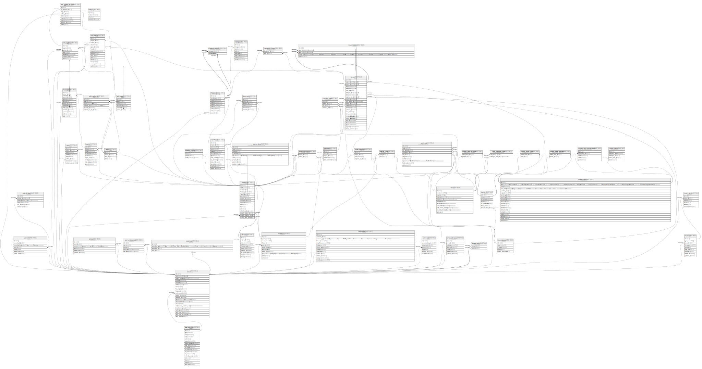

# app_dev

## Tables

| Name | Columns | Comment | Type |
| ---- | ------- | ------- | ---- |
| [ar_internal_metadata](ar_internal_metadata.md) | 4 |  | BASE TABLE |
| [attachments](attachments.md) | 13 |  | BASE TABLE |
| [auth_sources](auth_sources.md) | 17 |  | BASE TABLE |
| [boards](boards.md) | 9 |  | BASE TABLE |
| [changes](changes.md) | 8 |  | BASE TABLE |
| [changesets](changesets.md) | 9 |  | BASE TABLE |
| [changesets_issues](changesets_issues.md) | 2 |  | BASE TABLE |
| [changeset_parents](changeset_parents.md) | 2 |  | BASE TABLE |
| [comments](comments.md) | 7 |  | BASE TABLE |
| [custom_fields](custom_fields.md) | 19 |  | BASE TABLE |
| [custom_fields_projects](custom_fields_projects.md) | 2 |  | BASE TABLE |
| [custom_fields_roles](custom_fields_roles.md) | 2 |  | BASE TABLE |
| [custom_fields_trackers](custom_fields_trackers.md) | 2 |  | BASE TABLE |
| [custom_field_enumerations](custom_field_enumerations.md) | 5 |  | BASE TABLE |
| [custom_values](custom_values.md) | 5 |  | BASE TABLE |
| [documents](documents.md) | 6 |  | BASE TABLE |
| [email_addresses](email_addresses.md) | 7 |  | BASE TABLE |
| [enabled_modules](enabled_modules.md) | 3 |  | BASE TABLE |
| [enumerations](enumerations.md) | 9 |  | BASE TABLE |
| [global_issue_templates](global_issue_templates.md) | 16 |  | BASE TABLE |
| [global_issue_templates_projects](global_issue_templates_projects.md) | 2 |  | BASE TABLE |
| [global_note_templates](global_note_templates.md) | 11 |  | BASE TABLE |
| [global_note_template_projects](global_note_template_projects.md) | 2 |  | BASE TABLE |
| [global_note_visible_roles](global_note_visible_roles.md) | 5 |  | BASE TABLE |
| [groups_users](groups_users.md) | 2 |  | BASE TABLE |
| [imports](imports.md) | 9 |  | BASE TABLE |
| [import_items](import_items.md) | 6 |  | BASE TABLE |
| [issues](issues.md) | 24 |  | BASE TABLE |
| [issue_categories](issue_categories.md) | 4 |  | BASE TABLE |
| [issue_relations](issue_relations.md) | 5 |  | BASE TABLE |
| [issue_statuses](issue_statuses.md) | 5 |  | BASE TABLE |
| [issue_templates](issue_templates.md) | 18 |  | BASE TABLE |
| [issue_template_settings](issue_template_settings.md) | 6 |  | BASE TABLE |
| [journals](journals.md) | 7 |  | BASE TABLE |
| [journal_details](journal_details.md) | 6 |  | BASE TABLE |
| [members](members.md) | 5 |  | BASE TABLE |
| [member_roles](member_roles.md) | 4 |  | BASE TABLE |
| [messages](messages.md) | 12 |  | BASE TABLE |
| [news](news.md) | 8 |  | BASE TABLE |
| [note_templates](note_templates.md) | 12 |  | BASE TABLE |
| [note_visible_roles](note_visible_roles.md) | 5 |  | BASE TABLE |
| [projects](projects.md) | 16 |  | BASE TABLE |
| [projects_trackers](projects_trackers.md) | 2 |  | BASE TABLE |
| [queries](queries.md) | 11 |  | BASE TABLE |
| [queries_roles](queries_roles.md) | 2 |  | BASE TABLE |
| [repositories](repositories.md) | 13 |  | BASE TABLE |
| [roles](roles.md) | 11 |  | BASE TABLE |
| [roles_managed_roles](roles_managed_roles.md) | 2 |  | BASE TABLE |
| [schema_migrations](schema_migrations.md) | 1 |  | BASE TABLE |
| [settings](settings.md) | 4 |  | BASE TABLE |
| [time_entries](time_entries.md) | 14 |  | BASE TABLE |
| [tokens](tokens.md) | 6 |  | BASE TABLE |
| [trackers](trackers.md) | 7 |  | BASE TABLE |
| [users](users.md) | 21 |  | BASE TABLE |
| [user_preferences](user_preferences.md) | 5 |  | BASE TABLE |
| [versions](versions.md) | 10 |  | BASE TABLE |
| [view_customizes](view_customizes.md) | 10 |  | BASE TABLE |
| [watchers](watchers.md) | 4 |  | BASE TABLE |
| [wikis](wikis.md) | 4 |  | BASE TABLE |
| [wiki_contents](wiki_contents.md) | 7 |  | BASE TABLE |
| [wiki_content_versions](wiki_content_versions.md) | 9 |  | BASE TABLE |
| [wiki_pages](wiki_pages.md) | 6 |  | BASE TABLE |
| [wiki_redirects](wiki_redirects.md) | 6 |  | BASE TABLE |
| [workflows](workflows.md) | 10 |  | BASE TABLE |

## Relations

---

> Generated by [tbls](https://github.com/k1LoW/tbls)
