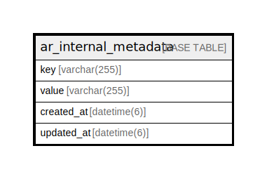

# ar_internal_metadata

## Description

<details>
<summary><strong>Table Definition</strong></summary>

```sql
CREATE TABLE `ar_internal_metadata` (
  `key` varchar(255) NOT NULL,
  `value` varchar(255) DEFAULT NULL,
  `created_at` datetime(6) NOT NULL,
  `updated_at` datetime(6) NOT NULL,
  PRIMARY KEY (`key`)
) ENGINE=InnoDB DEFAULT CHARSET=utf8mb4 COLLATE=utf8mb4_general_ci
```

</details>

## Columns

| Name | Type | Default | Nullable | Children | Parents | Comment |
| ---- | ---- | ------- | -------- | -------- | ------- | ------- |
| key | varchar(255) |  | false |  |  |  |
| value | varchar(255) | NULL | true |  |  |  |
| created_at | datetime(6) |  | false |  |  |  |
| updated_at | datetime(6) |  | false |  |  |  |

## Constraints

| Name | Type | Definition |
| ---- | ---- | ---------- |
| PRIMARY | PRIMARY KEY | PRIMARY KEY (key) |

## Indexes

| Name | Definition |
| ---- | ---------- |
| PRIMARY | PRIMARY KEY (key) USING BTREE |

## Relations



---

> Generated by [tbls](https://github.com/k1LoW/tbls)
