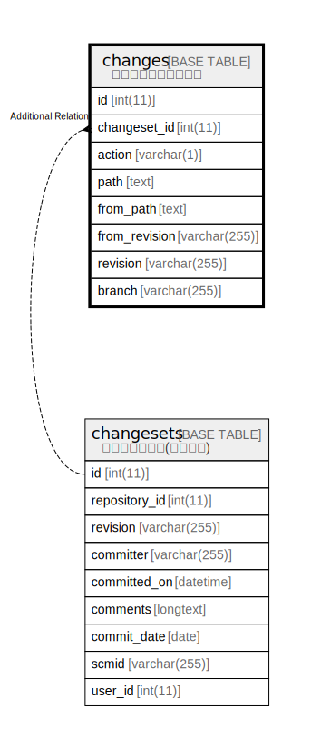

# changes

## Description

<details>
<summary><strong>Table Definition</strong></summary>

```sql
CREATE TABLE `changes` (
  `id` int(11) NOT NULL AUTO_INCREMENT,
  `changeset_id` int(11) NOT NULL,
  `action` varchar(1) NOT NULL DEFAULT '',
  `path` text NOT NULL,
  `from_path` text DEFAULT NULL,
  `from_revision` varchar(255) DEFAULT NULL,
  `revision` varchar(255) DEFAULT NULL,
  `branch` varchar(255) DEFAULT NULL,
  PRIMARY KEY (`id`),
  KEY `changesets_changeset_id` (`changeset_id`)
) ENGINE=InnoDB DEFAULT CHARSET=utf8mb4 COLLATE=utf8mb4_general_ci
```

</details>

## Columns

| Name | Type | Default | Nullable | Extra Definition | Children | Parents | Comment |
| ---- | ---- | ------- | -------- | ---------------- | -------- | ------- | ------- |
| id | int(11) |  | false | auto_increment |  |  |  |
| changeset_id | int(11) |  | false |  |  |  |  |
| action | varchar(1) | '' | false |  |  |  |  |
| path | text |  | false |  |  |  |  |
| from_path | text | NULL | true |  |  |  |  |
| from_revision | varchar(255) | NULL | true |  |  |  |  |
| revision | varchar(255) | NULL | true |  |  |  |  |
| branch | varchar(255) | NULL | true |  |  |  |  |

## Constraints

| Name | Type | Definition |
| ---- | ---- | ---------- |
| PRIMARY | PRIMARY KEY | PRIMARY KEY (id) |

## Indexes

| Name | Definition |
| ---- | ---------- |
| changesets_changeset_id | KEY changesets_changeset_id (changeset_id) USING BTREE |
| PRIMARY | PRIMARY KEY (id) USING BTREE |

## Relations



---

> Generated by [tbls](https://github.com/k1LoW/tbls)
