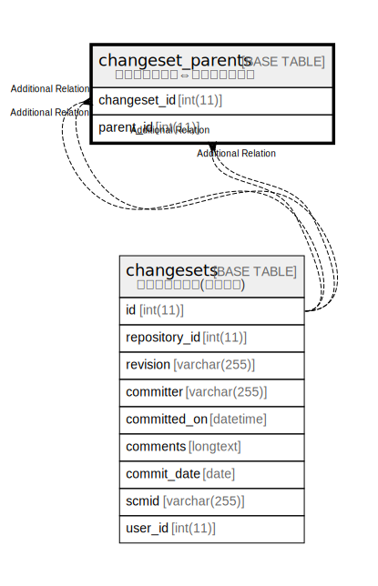

# changeset_parents

## Description

<details>
<summary><strong>Table Definition</strong></summary>

```sql
CREATE TABLE `changeset_parents` (
  `changeset_id` int(11) NOT NULL,
  `parent_id` int(11) NOT NULL,
  KEY `changeset_parents_changeset_ids` (`changeset_id`),
  KEY `changeset_parents_parent_ids` (`parent_id`)
) ENGINE=InnoDB DEFAULT CHARSET=utf8mb4 COLLATE=utf8mb4_general_ci
```

</details>

## Columns

| Name | Type | Default | Nullable | Children | Parents | Comment |
| ---- | ---- | ------- | -------- | -------- | ------- | ------- |
| changeset_id | int(11) |  | false |  |  |  |
| parent_id | int(11) |  | false |  |  |  |

## Indexes

| Name | Definition |
| ---- | ---------- |
| changeset_parents_changeset_ids | KEY changeset_parents_changeset_ids (changeset_id) USING BTREE |
| changeset_parents_parent_ids | KEY changeset_parents_parent_ids (parent_id) USING BTREE |

## Relations



---

> Generated by [tbls](https://github.com/k1LoW/tbls)
