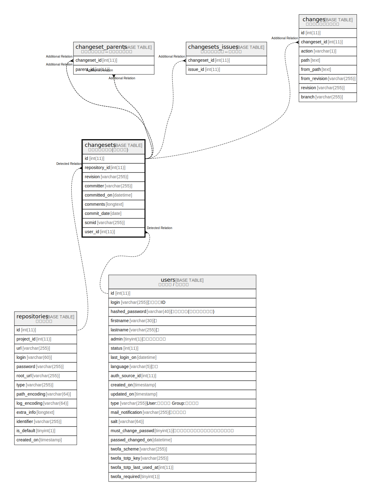

# changesets

## Description

<details>
<summary><strong>Table Definition</strong></summary>

```sql
CREATE TABLE `changesets` (
  `id` int(11) NOT NULL AUTO_INCREMENT,
  `repository_id` int(11) NOT NULL,
  `revision` varchar(255) NOT NULL,
  `committer` varchar(255) DEFAULT NULL,
  `committed_on` datetime NOT NULL,
  `comments` longtext DEFAULT NULL,
  `commit_date` date DEFAULT NULL,
  `scmid` varchar(255) DEFAULT NULL,
  `user_id` int(11) DEFAULT NULL,
  PRIMARY KEY (`id`),
  UNIQUE KEY `changesets_repos_rev` (`repository_id`,`revision`),
  KEY `index_changesets_on_user_id` (`user_id`),
  KEY `index_changesets_on_repository_id` (`repository_id`),
  KEY `index_changesets_on_committed_on` (`committed_on`),
  KEY `changesets_repos_scmid` (`repository_id`,`scmid`)
) ENGINE=InnoDB DEFAULT CHARSET=utf8mb4 COLLATE=utf8mb4_general_ci
```

</details>

## Columns

| Name | Type | Default | Nullable | Extra Definition | Children | Parents | Comment |
| ---- | ---- | ------- | -------- | ---------------- | -------- | ------- | ------- |
| id | int(11) |  | false | auto_increment |  |  |  |
| repository_id | int(11) |  | false |  |  |  |  |
| revision | varchar(255) |  | false |  |  |  |  |
| committer | varchar(255) | NULL | true |  |  |  |  |
| committed_on | datetime |  | false |  |  |  |  |
| comments | longtext | NULL | true |  |  |  |  |
| commit_date | date | NULL | true |  |  |  |  |
| scmid | varchar(255) | NULL | true |  |  |  |  |
| user_id | int(11) | NULL | true |  |  |  |  |

## Constraints

| Name | Type | Definition |
| ---- | ---- | ---------- |
| changesets_repos_rev | UNIQUE | UNIQUE KEY changesets_repos_rev (repository_id, revision) |
| PRIMARY | PRIMARY KEY | PRIMARY KEY (id) |

## Indexes

| Name | Definition |
| ---- | ---------- |
| changesets_repos_scmid | KEY changesets_repos_scmid (repository_id, scmid) USING BTREE |
| index_changesets_on_committed_on | KEY index_changesets_on_committed_on (committed_on) USING BTREE |
| index_changesets_on_repository_id | KEY index_changesets_on_repository_id (repository_id) USING BTREE |
| index_changesets_on_user_id | KEY index_changesets_on_user_id (user_id) USING BTREE |
| PRIMARY | PRIMARY KEY (id) USING BTREE |
| changesets_repos_rev | UNIQUE KEY changesets_repos_rev (repository_id, revision) USING BTREE |

## Relations



---

> Generated by [tbls](https://github.com/k1LoW/tbls)
