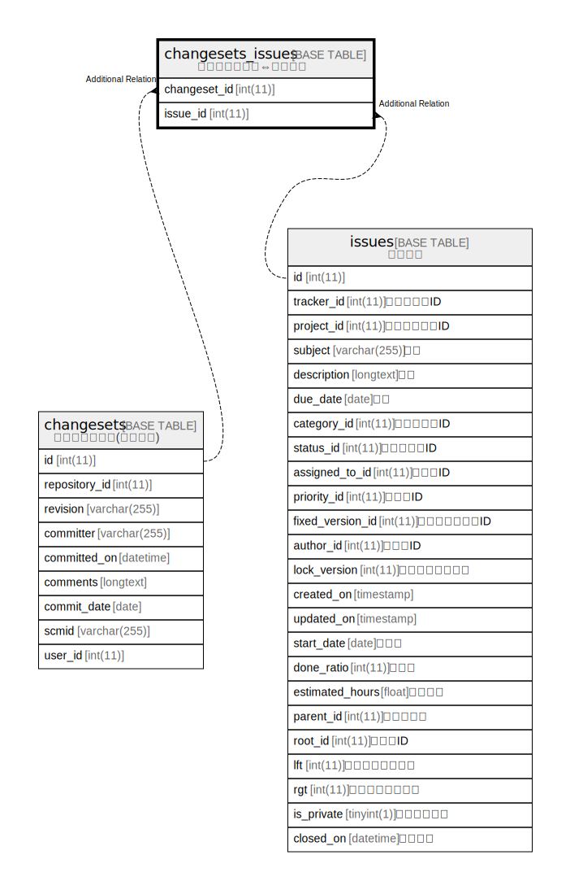

# changesets_issues

## Description

<details>
<summary><strong>Table Definition</strong></summary>

```sql
CREATE TABLE `changesets_issues` (
  `changeset_id` int(11) NOT NULL,
  `issue_id` int(11) NOT NULL,
  UNIQUE KEY `changesets_issues_ids` (`changeset_id`,`issue_id`),
  KEY `index_changesets_issues_on_issue_id` (`issue_id`)
) ENGINE=InnoDB DEFAULT CHARSET=utf8mb4 COLLATE=utf8mb4_general_ci
```

</details>

## Columns

| Name | Type | Default | Nullable | Children | Parents | Comment |
| ---- | ---- | ------- | -------- | -------- | ------- | ------- |
| changeset_id | int(11) |  | false |  |  |  |
| issue_id | int(11) |  | false |  |  |  |

## Constraints

| Name | Type | Definition |
| ---- | ---- | ---------- |
| changesets_issues_ids | UNIQUE | UNIQUE KEY changesets_issues_ids (changeset_id, issue_id) |

## Indexes

| Name | Definition |
| ---- | ---------- |
| index_changesets_issues_on_issue_id | KEY index_changesets_issues_on_issue_id (issue_id) USING BTREE |
| changesets_issues_ids | UNIQUE KEY changesets_issues_ids (changeset_id, issue_id) USING BTREE |

## Relations



---

> Generated by [tbls](https://github.com/k1LoW/tbls)
