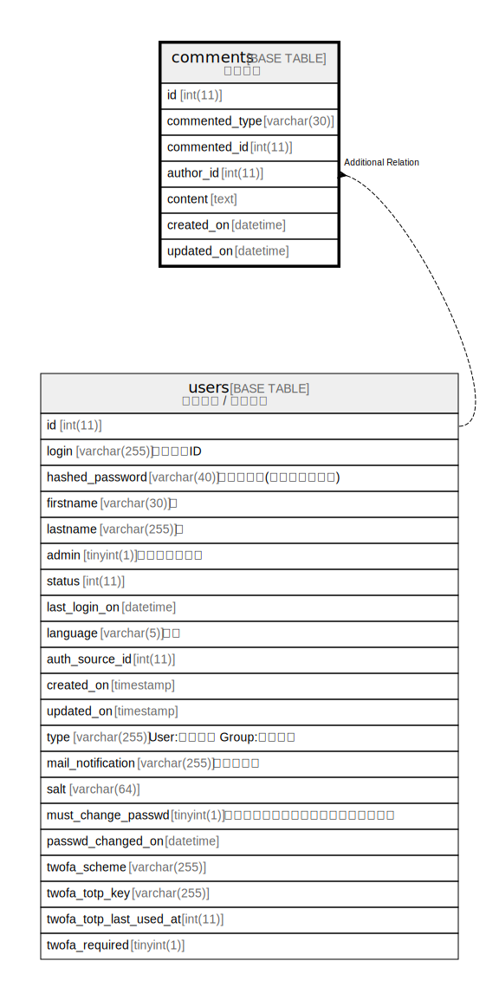

# comments

## Description

<details>
<summary><strong>Table Definition</strong></summary>

```sql
CREATE TABLE `comments` (
  `id` int(11) NOT NULL AUTO_INCREMENT,
  `commented_type` varchar(30) NOT NULL DEFAULT '',
  `commented_id` int(11) NOT NULL DEFAULT 0,
  `author_id` int(11) NOT NULL DEFAULT 0,
  `content` text DEFAULT NULL,
  `created_on` datetime NOT NULL,
  `updated_on` datetime NOT NULL,
  PRIMARY KEY (`id`),
  KEY `index_comments_on_commented_id_and_commented_type` (`commented_id`,`commented_type`),
  KEY `index_comments_on_author_id` (`author_id`)
) ENGINE=InnoDB DEFAULT CHARSET=utf8mb4 COLLATE=utf8mb4_general_ci
```

</details>

## Columns

| Name | Type | Default | Nullable | Extra Definition | Children | Parents | Comment |
| ---- | ---- | ------- | -------- | ---------------- | -------- | ------- | ------- |
| id | int(11) |  | false | auto_increment |  |  |  |
| commented_type | varchar(30) | '' | false |  |  |  |  |
| commented_id | int(11) | 0 | false |  |  |  |  |
| author_id | int(11) | 0 | false |  |  |  |  |
| content | text | NULL | true |  |  |  |  |
| created_on | datetime |  | false |  |  |  |  |
| updated_on | datetime |  | false |  |  |  |  |

## Constraints

| Name | Type | Definition |
| ---- | ---- | ---------- |
| PRIMARY | PRIMARY KEY | PRIMARY KEY (id) |

## Indexes

| Name | Definition |
| ---- | ---------- |
| index_comments_on_author_id | KEY index_comments_on_author_id (author_id) USING BTREE |
| index_comments_on_commented_id_and_commented_type | KEY index_comments_on_commented_id_and_commented_type (commented_id, commented_type) USING BTREE |
| PRIMARY | PRIMARY KEY (id) USING BTREE |

## Relations



---

> Generated by [tbls](https://github.com/k1LoW/tbls)
