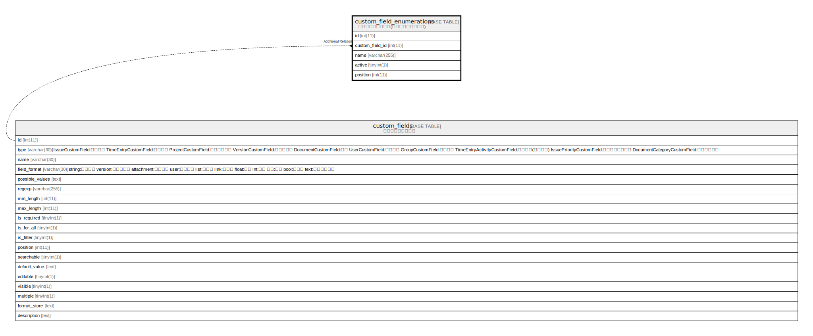

# custom_field_enumerations

## Description

<details>
<summary><strong>Table Definition</strong></summary>

```sql
CREATE TABLE `custom_field_enumerations` (
  `id` int(11) NOT NULL AUTO_INCREMENT,
  `custom_field_id` int(11) NOT NULL,
  `name` varchar(255) NOT NULL,
  `active` tinyint(1) NOT NULL DEFAULT 1,
  `position` int(11) NOT NULL DEFAULT 1,
  PRIMARY KEY (`id`)
) ENGINE=InnoDB DEFAULT CHARSET=utf8mb4 COLLATE=utf8mb4_general_ci
```

</details>

## Columns

| Name | Type | Default | Nullable | Extra Definition | Children | Parents | Comment |
| ---- | ---- | ------- | -------- | ---------------- | -------- | ------- | ------- |
| id | int(11) |  | false | auto_increment |  |  |  |
| custom_field_id | int(11) |  | false |  |  |  |  |
| name | varchar(255) |  | false |  |  |  |  |
| active | tinyint(1) | 1 | false |  |  |  |  |
| position | int(11) | 1 | false |  |  |  |  |

## Constraints

| Name | Type | Definition |
| ---- | ---- | ---------- |
| PRIMARY | PRIMARY KEY | PRIMARY KEY (id) |

## Indexes

| Name | Definition |
| ---- | ---------- |
| PRIMARY | PRIMARY KEY (id) USING BTREE |

## Relations



---

> Generated by [tbls](https://github.com/k1LoW/tbls)
