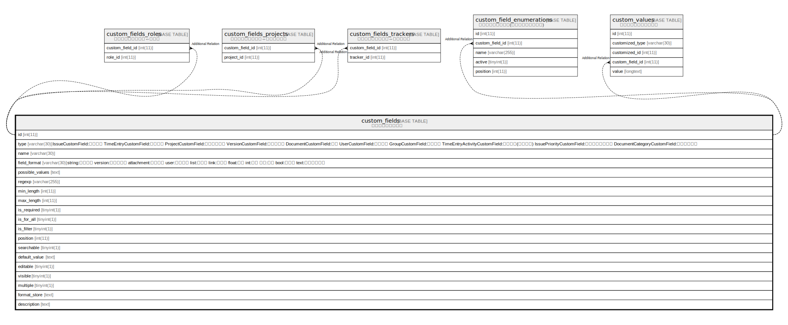

# custom_fields

## Description

<details>
<summary><strong>Table Definition</strong></summary>

```sql
CREATE TABLE `custom_fields` (
  `id` int(11) NOT NULL AUTO_INCREMENT,
  `type` varchar(30) NOT NULL DEFAULT '',
  `name` varchar(30) NOT NULL DEFAULT '',
  `field_format` varchar(30) NOT NULL DEFAULT '',
  `possible_values` text DEFAULT NULL,
  `regexp` varchar(255) DEFAULT '',
  `min_length` int(11) DEFAULT NULL,
  `max_length` int(11) DEFAULT NULL,
  `is_required` tinyint(1) NOT NULL DEFAULT 0,
  `is_for_all` tinyint(1) NOT NULL DEFAULT 0,
  `is_filter` tinyint(1) NOT NULL DEFAULT 0,
  `position` int(11) DEFAULT NULL,
  `searchable` tinyint(1) DEFAULT 0,
  `default_value` text DEFAULT NULL,
  `editable` tinyint(1) DEFAULT 1,
  `visible` tinyint(1) NOT NULL DEFAULT 1,
  `multiple` tinyint(1) DEFAULT 0,
  `format_store` text DEFAULT NULL,
  `description` text DEFAULT NULL,
  PRIMARY KEY (`id`),
  KEY `index_custom_fields_on_id_and_type` (`id`,`type`)
) ENGINE=InnoDB DEFAULT CHARSET=utf8mb4 COLLATE=utf8mb4_general_ci
```

</details>

## Columns

| Name | Type | Default | Nullable | Extra Definition | Children | Parents | Comment |
| ---- | ---- | ------- | -------- | ---------------- | -------- | ------- | ------- |
| id | int(11) |  | false | auto_increment |  |  |  |
| type | varchar(30) | '' | false |  |  |  |  |
| name | varchar(30) | '' | false |  |  |  |  |
| field_format | varchar(30) | '' | false |  |  |  |  |
| possible_values | text | NULL | true |  |  |  |  |
| regexp | varchar(255) | '' | true |  |  |  |  |
| min_length | int(11) | NULL | true |  |  |  |  |
| max_length | int(11) | NULL | true |  |  |  |  |
| is_required | tinyint(1) | 0 | false |  |  |  |  |
| is_for_all | tinyint(1) | 0 | false |  |  |  |  |
| is_filter | tinyint(1) | 0 | false |  |  |  |  |
| position | int(11) | NULL | true |  |  |  |  |
| searchable | tinyint(1) | 0 | true |  |  |  |  |
| default_value | text | NULL | true |  |  |  |  |
| editable | tinyint(1) | 1 | true |  |  |  |  |
| visible | tinyint(1) | 1 | false |  |  |  |  |
| multiple | tinyint(1) | 0 | true |  |  |  |  |
| format_store | text | NULL | true |  |  |  |  |
| description | text | NULL | true |  |  |  |  |

## Constraints

| Name | Type | Definition |
| ---- | ---- | ---------- |
| PRIMARY | PRIMARY KEY | PRIMARY KEY (id) |

## Indexes

| Name | Definition |
| ---- | ---------- |
| index_custom_fields_on_id_and_type | KEY index_custom_fields_on_id_and_type (id, type) USING BTREE |
| PRIMARY | PRIMARY KEY (id) USING BTREE |

## Relations



---

> Generated by [tbls](https://github.com/k1LoW/tbls)
