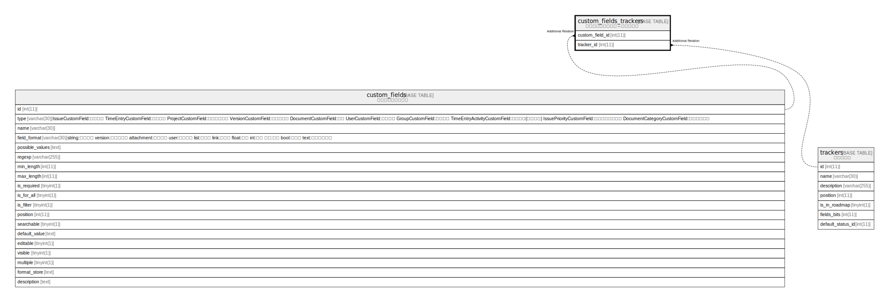

# custom_fields_trackers

## Description

<details>
<summary><strong>Table Definition</strong></summary>

```sql
CREATE TABLE `custom_fields_trackers` (
  `custom_field_id` int(11) NOT NULL DEFAULT 0,
  `tracker_id` int(11) NOT NULL DEFAULT 0,
  UNIQUE KEY `index_custom_fields_trackers_on_custom_field_id_and_tracker_id` (`custom_field_id`,`tracker_id`)
) ENGINE=InnoDB DEFAULT CHARSET=utf8mb4 COLLATE=utf8mb4_general_ci
```

</details>

## Columns

| Name | Type | Default | Nullable | Children | Parents | Comment |
| ---- | ---- | ------- | -------- | -------- | ------- | ------- |
| custom_field_id | int(11) | 0 | false |  |  |  |
| tracker_id | int(11) | 0 | false |  |  |  |

## Constraints

| Name | Type | Definition |
| ---- | ---- | ---------- |
| index_custom_fields_trackers_on_custom_field_id_and_tracker_id | UNIQUE | UNIQUE KEY index_custom_fields_trackers_on_custom_field_id_and_tracker_id (custom_field_id, tracker_id) |

## Indexes

| Name | Definition |
| ---- | ---------- |
| index_custom_fields_trackers_on_custom_field_id_and_tracker_id | UNIQUE KEY index_custom_fields_trackers_on_custom_field_id_and_tracker_id (custom_field_id, tracker_id) USING BTREE |

## Relations



---

> Generated by [tbls](https://github.com/k1LoW/tbls)
