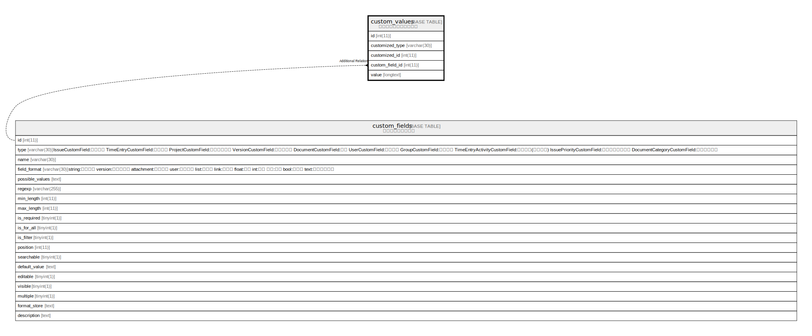

# custom_values

## Description

<details>
<summary><strong>Table Definition</strong></summary>

```sql
CREATE TABLE `custom_values` (
  `id` int(11) NOT NULL AUTO_INCREMENT,
  `customized_type` varchar(30) NOT NULL DEFAULT '',
  `customized_id` int(11) NOT NULL DEFAULT 0,
  `custom_field_id` int(11) NOT NULL DEFAULT 0,
  `value` longtext DEFAULT NULL,
  PRIMARY KEY (`id`),
  KEY `custom_values_customized` (`customized_type`,`customized_id`),
  KEY `index_custom_values_on_custom_field_id` (`custom_field_id`)
) ENGINE=InnoDB DEFAULT CHARSET=utf8mb4 COLLATE=utf8mb4_general_ci
```

</details>

## Columns

| Name | Type | Default | Nullable | Extra Definition | Children | Parents | Comment |
| ---- | ---- | ------- | -------- | ---------------- | -------- | ------- | ------- |
| id | int(11) |  | false | auto_increment |  |  |  |
| customized_type | varchar(30) | '' | false |  |  |  |  |
| customized_id | int(11) | 0 | false |  |  |  |  |
| custom_field_id | int(11) | 0 | false |  |  |  |  |
| value | longtext | NULL | true |  |  |  |  |

## Constraints

| Name | Type | Definition |
| ---- | ---- | ---------- |
| PRIMARY | PRIMARY KEY | PRIMARY KEY (id) |

## Indexes

| Name | Definition |
| ---- | ---------- |
| custom_values_customized | KEY custom_values_customized (customized_type, customized_id) USING BTREE |
| index_custom_values_on_custom_field_id | KEY index_custom_values_on_custom_field_id (custom_field_id) USING BTREE |
| PRIMARY | PRIMARY KEY (id) USING BTREE |

## Relations



---

> Generated by [tbls](https://github.com/k1LoW/tbls)
