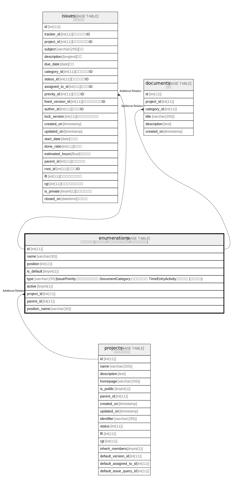

# enumerations

## Description

<details>
<summary><strong>Table Definition</strong></summary>

```sql
CREATE TABLE `enumerations` (
  `id` int(11) NOT NULL AUTO_INCREMENT,
  `name` varchar(30) NOT NULL DEFAULT '',
  `position` int(11) DEFAULT NULL,
  `is_default` tinyint(1) NOT NULL DEFAULT 0,
  `type` varchar(255) DEFAULT NULL,
  `active` tinyint(1) NOT NULL DEFAULT 1,
  `project_id` int(11) DEFAULT NULL,
  `parent_id` int(11) DEFAULT NULL,
  `position_name` varchar(30) DEFAULT NULL,
  PRIMARY KEY (`id`),
  KEY `index_enumerations_on_project_id` (`project_id`),
  KEY `index_enumerations_on_id_and_type` (`id`,`type`)
) ENGINE=InnoDB AUTO_INCREMENT=[Redacted by tbls] DEFAULT CHARSET=utf8mb4 COLLATE=utf8mb4_general_ci
```

</details>

## Columns

| Name | Type | Default | Nullable | Extra Definition | Children | Parents | Comment |
| ---- | ---- | ------- | -------- | ---------------- | -------- | ------- | ------- |
| id | int(11) |  | false | auto_increment |  |  |  |
| name | varchar(30) | '' | false |  |  |  |  |
| position | int(11) | NULL | true |  |  |  |  |
| is_default | tinyint(1) | 0 | false |  |  |  |  |
| type | varchar(255) | NULL | true |  |  |  |  |
| active | tinyint(1) | 1 | false |  |  |  |  |
| project_id | int(11) | NULL | true |  |  |  |  |
| parent_id | int(11) | NULL | true |  |  |  |  |
| position_name | varchar(30) | NULL | true |  |  |  |  |

## Constraints

| Name | Type | Definition |
| ---- | ---- | ---------- |
| PRIMARY | PRIMARY KEY | PRIMARY KEY (id) |

## Indexes

| Name | Definition |
| ---- | ---------- |
| index_enumerations_on_id_and_type | KEY index_enumerations_on_id_and_type (id, type) USING BTREE |
| index_enumerations_on_project_id | KEY index_enumerations_on_project_id (project_id) USING BTREE |
| PRIMARY | PRIMARY KEY (id) USING BTREE |

## Relations



---

> Generated by [tbls](https://github.com/k1LoW/tbls)
