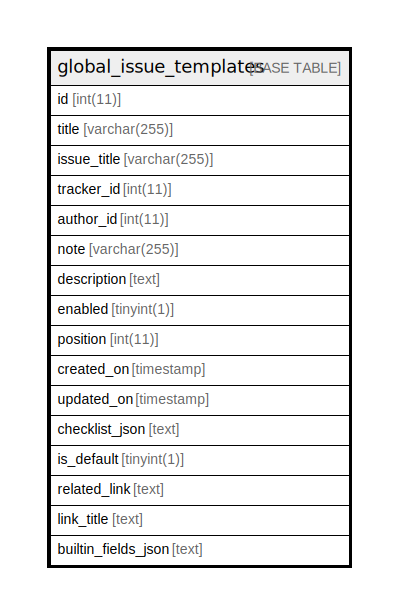

# global_issue_templates

## Description

<details>
<summary><strong>Table Definition</strong></summary>

```sql
CREATE TABLE `global_issue_templates` (
  `id` int(11) NOT NULL AUTO_INCREMENT,
  `title` varchar(255) DEFAULT NULL,
  `issue_title` varchar(255) DEFAULT NULL,
  `tracker_id` int(11) DEFAULT NULL,
  `author_id` int(11) DEFAULT NULL,
  `note` varchar(255) DEFAULT NULL,
  `description` text DEFAULT NULL,
  `enabled` tinyint(1) NOT NULL DEFAULT 0,
  `position` int(11) DEFAULT NULL,
  `created_on` timestamp NULL DEFAULT NULL,
  `updated_on` timestamp NULL DEFAULT NULL,
  `checklist_json` text DEFAULT NULL,
  `is_default` tinyint(1) NOT NULL DEFAULT 0,
  `related_link` text DEFAULT NULL,
  `link_title` text DEFAULT NULL,
  `builtin_fields_json` text DEFAULT NULL,
  PRIMARY KEY (`id`),
  KEY `index_global_issue_templates_on_author_id` (`author_id`),
  KEY `index_global_issue_templates_on_tracker_id` (`tracker_id`)
) ENGINE=InnoDB DEFAULT CHARSET=utf8mb4 COLLATE=utf8mb4_general_ci
```

</details>

## Columns

| Name | Type | Default | Nullable | Extra Definition | Children | Parents | Comment |
| ---- | ---- | ------- | -------- | ---------------- | -------- | ------- | ------- |
| id | int(11) |  | false | auto_increment |  |  |  |
| title | varchar(255) | NULL | true |  |  |  |  |
| issue_title | varchar(255) | NULL | true |  |  |  |  |
| tracker_id | int(11) | NULL | true |  |  |  |  |
| author_id | int(11) | NULL | true |  |  |  |  |
| note | varchar(255) | NULL | true |  |  |  |  |
| description | text | NULL | true |  |  |  |  |
| enabled | tinyint(1) | 0 | false |  |  |  |  |
| position | int(11) | NULL | true |  |  |  |  |
| created_on | timestamp | NULL | true |  |  |  |  |
| updated_on | timestamp | NULL | true |  |  |  |  |
| checklist_json | text | NULL | true |  |  |  |  |
| is_default | tinyint(1) | 0 | false |  |  |  |  |
| related_link | text | NULL | true |  |  |  |  |
| link_title | text | NULL | true |  |  |  |  |
| builtin_fields_json | text | NULL | true |  |  |  |  |

## Constraints

| Name | Type | Definition |
| ---- | ---- | ---------- |
| PRIMARY | PRIMARY KEY | PRIMARY KEY (id) |

## Indexes

| Name | Definition |
| ---- | ---------- |
| index_global_issue_templates_on_author_id | KEY index_global_issue_templates_on_author_id (author_id) USING BTREE |
| index_global_issue_templates_on_tracker_id | KEY index_global_issue_templates_on_tracker_id (tracker_id) USING BTREE |
| PRIMARY | PRIMARY KEY (id) USING BTREE |

## Relations



---

> Generated by [tbls](https://github.com/k1LoW/tbls)
