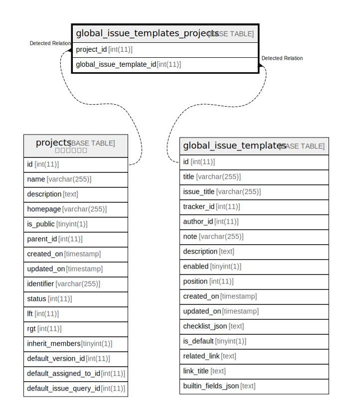

# global_issue_templates_projects

## 概要

<details>
<summary><strong>テーブル定義</strong></summary>

```sql
CREATE TABLE `global_issue_templates_projects` (
  `project_id` int(11) DEFAULT NULL,
  `global_issue_template_id` int(11) DEFAULT NULL,
  UNIQUE KEY `projects_global_issue_templates` (`project_id`,`global_issue_template_id`)
) ENGINE=InnoDB DEFAULT CHARSET=utf8mb4 COLLATE=utf8mb4_general_ci
```

</details>

## カラム一覧

| 名前                       | タイプ     | デフォルト値       | NULL許可   | 子テーブル      | 親テーブル                                               | コメント     |
| ------------------------ | ------- | ------------ | -------- | ---------- | --------------------------------------------------- | -------- |
| project_id               | int(11) | NULL         | true     |            | [projects](projects.md)                             |          |
| global_issue_template_id | int(11) | NULL         | true     |            | [global_issue_templates](global_issue_templates.md) |          |

## 制約一覧

| 名前                              | タイプ    | 定義                                                                                |
| ------------------------------- | ------ | --------------------------------------------------------------------------------- |
| projects_global_issue_templates | UNIQUE | UNIQUE KEY projects_global_issue_templates (project_id, global_issue_template_id) |

## INDEX一覧

| 名前                              | 定義                                                                                            |
| ------------------------------- | --------------------------------------------------------------------------------------------- |
| projects_global_issue_templates | UNIQUE KEY projects_global_issue_templates (project_id, global_issue_template_id) USING BTREE |

## ER図



---

> Generated by [tbls](https://github.com/k1LoW/tbls)
