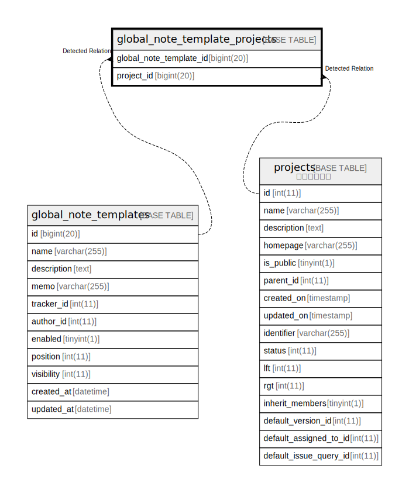

# global_note_template_projects

## Description

<details>
<summary><strong>Table Definition</strong></summary>

```sql
CREATE TABLE `global_note_template_projects` (
  `global_note_template_id` bigint(20) NOT NULL,
  `project_id` bigint(20) NOT NULL
) ENGINE=InnoDB DEFAULT CHARSET=utf8mb4 COLLATE=utf8mb4_general_ci
```

</details>

## Columns

| Name | Type | Default | Nullable | Children | Parents | Comment |
| ---- | ---- | ------- | -------- | -------- | ------- | ------- |
| global_note_template_id | bigint(20) |  | false |  |  |  |
| project_id | bigint(20) |  | false |  |  |  |

## Relations



---

> Generated by [tbls](https://github.com/k1LoW/tbls)
