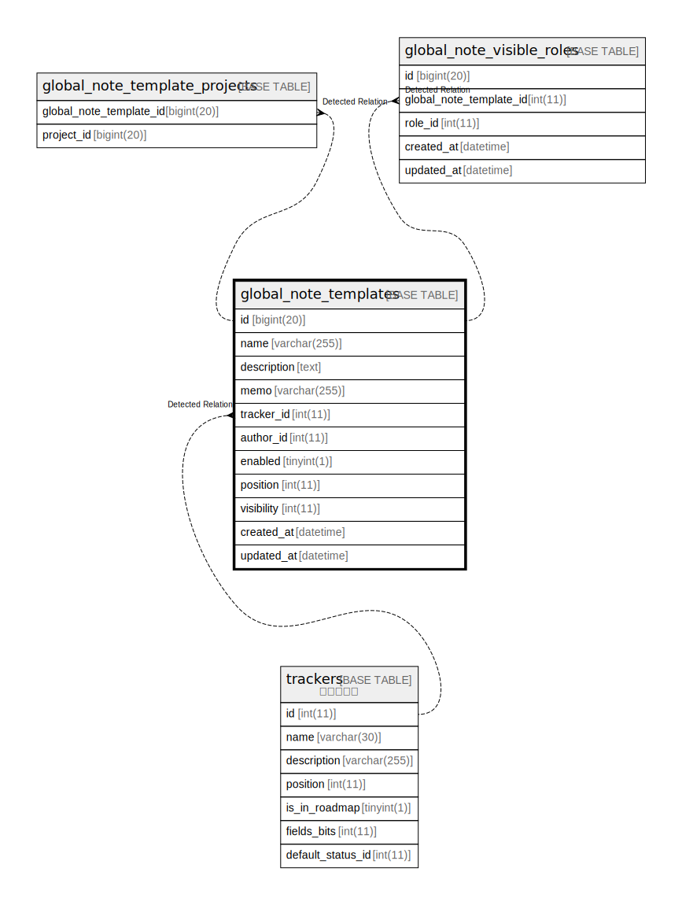

# global_note_templates

## 概要

<details>
<summary><strong>テーブル定義</strong></summary>

```sql
CREATE TABLE `global_note_templates` (
  `id` bigint(20) NOT NULL AUTO_INCREMENT,
  `name` varchar(255) DEFAULT NULL,
  `description` text DEFAULT NULL,
  `memo` varchar(255) DEFAULT NULL,
  `tracker_id` int(11) DEFAULT NULL,
  `author_id` int(11) DEFAULT NULL,
  `enabled` tinyint(1) DEFAULT NULL,
  `position` int(11) DEFAULT NULL,
  `visibility` int(11) DEFAULT 2,
  `created_at` datetime NOT NULL,
  `updated_at` datetime NOT NULL,
  PRIMARY KEY (`id`),
  KEY `index_global_note_templates_on_author_id` (`author_id`),
  KEY `index_global_note_templates_on_tracker_id` (`tracker_id`),
  KEY `index_global_note_templates_on_enabled` (`enabled`)
) ENGINE=InnoDB DEFAULT CHARSET=utf8mb4 COLLATE=utf8mb4_general_ci
```

</details>

## カラム一覧

| 名前          | タイプ          | デフォルト値       | NULL許可   | Extra Definition | 子テーブル                                                                                                                       | 親テーブル                   | コメント     |
| ----------- | ------------ | ------------ | -------- | ---------------- | --------------------------------------------------------------------------------------------------------------------------- | ----------------------- | -------- |
| id          | bigint(20)   |              | false    | auto_increment   | [global_note_template_projects](global_note_template_projects.md) [global_note_visible_roles](global_note_visible_roles.md) |                         |          |
| name        | varchar(255) | NULL         | true     |                  |                                                                                                                             |                         |          |
| description | text         | NULL         | true     |                  |                                                                                                                             |                         |          |
| memo        | varchar(255) | NULL         | true     |                  |                                                                                                                             |                         |          |
| tracker_id  | int(11)      | NULL         | true     |                  |                                                                                                                             | [trackers](trackers.md) |          |
| author_id   | int(11)      | NULL         | true     |                  |                                                                                                                             |                         |          |
| enabled     | tinyint(1)   | NULL         | true     |                  |                                                                                                                             |                         |          |
| position    | int(11)      | NULL         | true     |                  |                                                                                                                             |                         |          |
| visibility  | int(11)      | 2            | true     |                  |                                                                                                                             |                         |          |
| created_at  | datetime     |              | false    |                  |                                                                                                                             |                         |          |
| updated_at  | datetime     |              | false    |                  |                                                                                                                             |                         |          |

## 制約一覧

| 名前      | タイプ         | 定義               |
| ------- | ----------- | ---------------- |
| PRIMARY | PRIMARY KEY | PRIMARY KEY (id) |

## INDEX一覧

| 名前                                        | 定義                                                                     |
| ----------------------------------------- | ---------------------------------------------------------------------- |
| index_global_note_templates_on_author_id  | KEY index_global_note_templates_on_author_id (author_id) USING BTREE   |
| index_global_note_templates_on_enabled    | KEY index_global_note_templates_on_enabled (enabled) USING BTREE       |
| index_global_note_templates_on_tracker_id | KEY index_global_note_templates_on_tracker_id (tracker_id) USING BTREE |
| PRIMARY                                   | PRIMARY KEY (id) USING BTREE                                           |

## ER図



---

> Generated by [tbls](https://github.com/k1LoW/tbls)
