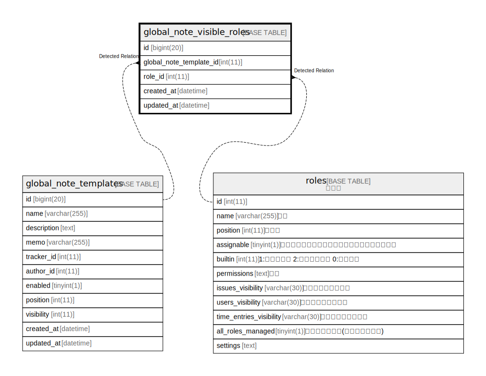

# global_note_visible_roles

## Description

<details>
<summary><strong>Table Definition</strong></summary>

```sql
CREATE TABLE `global_note_visible_roles` (
  `id` bigint(20) NOT NULL AUTO_INCREMENT,
  `global_note_template_id` int(11) DEFAULT NULL,
  `role_id` int(11) DEFAULT NULL,
  `created_at` datetime NOT NULL,
  `updated_at` datetime NOT NULL,
  PRIMARY KEY (`id`),
  KEY `index_global_note_visible_roles_on_global_note_template_id` (`global_note_template_id`),
  KEY `index_global_note_visible_roles_on_role_id` (`role_id`)
) ENGINE=InnoDB DEFAULT CHARSET=utf8mb4 COLLATE=utf8mb4_general_ci
```

</details>

## Columns

| Name | Type | Default | Nullable | Extra Definition | Children | Parents | Comment |
| ---- | ---- | ------- | -------- | ---------------- | -------- | ------- | ------- |
| id | bigint(20) |  | false | auto_increment |  |  |  |
| global_note_template_id | int(11) | NULL | true |  |  |  |  |
| role_id | int(11) | NULL | true |  |  |  |  |
| created_at | datetime |  | false |  |  |  |  |
| updated_at | datetime |  | false |  |  |  |  |

## Constraints

| Name | Type | Definition |
| ---- | ---- | ---------- |
| PRIMARY | PRIMARY KEY | PRIMARY KEY (id) |

## Indexes

| Name | Definition |
| ---- | ---------- |
| index_global_note_visible_roles_on_global_note_template_id | KEY index_global_note_visible_roles_on_global_note_template_id (global_note_template_id) USING BTREE |
| index_global_note_visible_roles_on_role_id | KEY index_global_note_visible_roles_on_role_id (role_id) USING BTREE |
| PRIMARY | PRIMARY KEY (id) USING BTREE |

## Relations



---

> Generated by [tbls](https://github.com/k1LoW/tbls)
