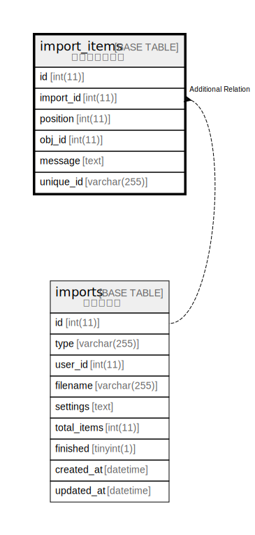

# import_items

## Description

<details>
<summary><strong>Table Definition</strong></summary>

```sql
CREATE TABLE `import_items` (
  `id` int(11) NOT NULL AUTO_INCREMENT,
  `import_id` int(11) NOT NULL,
  `position` int(11) NOT NULL,
  `obj_id` int(11) DEFAULT NULL,
  `message` text DEFAULT NULL,
  `unique_id` varchar(255) DEFAULT NULL,
  PRIMARY KEY (`id`),
  KEY `index_import_items_on_import_id_and_unique_id` (`import_id`,`unique_id`)
) ENGINE=InnoDB DEFAULT CHARSET=utf8mb4 COLLATE=utf8mb4_general_ci
```

</details>

## Columns

| Name | Type | Default | Nullable | Extra Definition | Children | Parents | Comment |
| ---- | ---- | ------- | -------- | ---------------- | -------- | ------- | ------- |
| id | int(11) |  | false | auto_increment |  |  |  |
| import_id | int(11) |  | false |  |  |  |  |
| position | int(11) |  | false |  |  |  |  |
| obj_id | int(11) | NULL | true |  |  |  |  |
| message | text | NULL | true |  |  |  |  |
| unique_id | varchar(255) | NULL | true |  |  |  |  |

## Constraints

| Name | Type | Definition |
| ---- | ---- | ---------- |
| PRIMARY | PRIMARY KEY | PRIMARY KEY (id) |

## Indexes

| Name | Definition |
| ---- | ---------- |
| index_import_items_on_import_id_and_unique_id | KEY index_import_items_on_import_id_and_unique_id (import_id, unique_id) USING BTREE |
| PRIMARY | PRIMARY KEY (id) USING BTREE |

## Relations



---

> Generated by [tbls](https://github.com/k1LoW/tbls)
