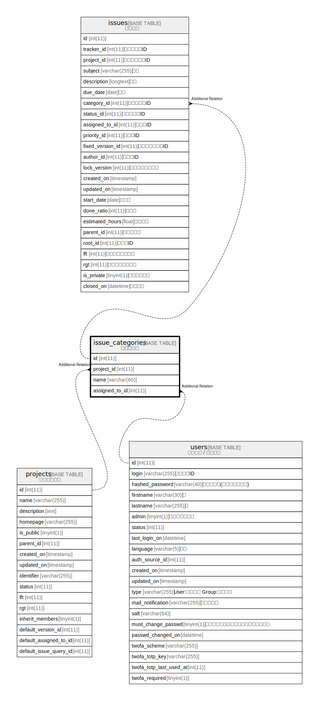

# issue_categories

## Description

<details>
<summary><strong>Table Definition</strong></summary>

```sql
CREATE TABLE `issue_categories` (
  `id` int(11) NOT NULL AUTO_INCREMENT,
  `project_id` int(11) NOT NULL DEFAULT 0,
  `name` varchar(60) NOT NULL DEFAULT '',
  `assigned_to_id` int(11) DEFAULT NULL,
  PRIMARY KEY (`id`),
  KEY `issue_categories_project_id` (`project_id`),
  KEY `index_issue_categories_on_assigned_to_id` (`assigned_to_id`)
) ENGINE=InnoDB DEFAULT CHARSET=utf8mb4 COLLATE=utf8mb4_general_ci
```

</details>

## Columns

| Name | Type | Default | Nullable | Extra Definition | Children | Parents | Comment |
| ---- | ---- | ------- | -------- | ---------------- | -------- | ------- | ------- |
| id | int(11) |  | false | auto_increment |  |  |  |
| project_id | int(11) | 0 | false |  |  |  |  |
| name | varchar(60) | '' | false |  |  |  |  |
| assigned_to_id | int(11) | NULL | true |  |  |  |  |

## Constraints

| Name | Type | Definition |
| ---- | ---- | ---------- |
| PRIMARY | PRIMARY KEY | PRIMARY KEY (id) |

## Indexes

| Name | Definition |
| ---- | ---------- |
| index_issue_categories_on_assigned_to_id | KEY index_issue_categories_on_assigned_to_id (assigned_to_id) USING BTREE |
| issue_categories_project_id | KEY issue_categories_project_id (project_id) USING BTREE |
| PRIMARY | PRIMARY KEY (id) USING BTREE |

## Relations



---

> Generated by [tbls](https://github.com/k1LoW/tbls)
