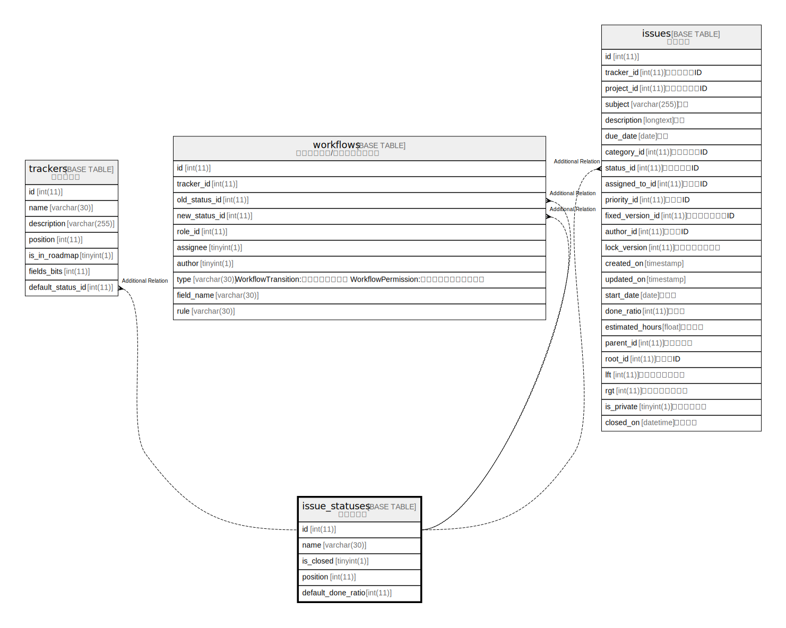

# issue_statuses

## Description

<details>
<summary><strong>Table Definition</strong></summary>

```sql
CREATE TABLE `issue_statuses` (
  `id` int(11) NOT NULL AUTO_INCREMENT,
  `name` varchar(30) NOT NULL DEFAULT '',
  `is_closed` tinyint(1) NOT NULL DEFAULT 0,
  `position` int(11) DEFAULT NULL,
  `default_done_ratio` int(11) DEFAULT NULL,
  PRIMARY KEY (`id`),
  KEY `index_issue_statuses_on_position` (`position`),
  KEY `index_issue_statuses_on_is_closed` (`is_closed`)
) ENGINE=InnoDB AUTO_INCREMENT=[Redacted by tbls] DEFAULT CHARSET=utf8mb4 COLLATE=utf8mb4_general_ci
```

</details>

## Columns

| Name | Type | Default | Nullable | Extra Definition | Children | Parents | Comment |
| ---- | ---- | ------- | -------- | ---------------- | -------- | ------- | ------- |
| id | int(11) |  | false | auto_increment |  |  |  |
| name | varchar(30) | '' | false |  |  |  |  |
| is_closed | tinyint(1) | 0 | false |  |  |  |  |
| position | int(11) | NULL | true |  |  |  |  |
| default_done_ratio | int(11) | NULL | true |  |  |  |  |

## Constraints

| Name | Type | Definition |
| ---- | ---- | ---------- |
| PRIMARY | PRIMARY KEY | PRIMARY KEY (id) |

## Indexes

| Name | Definition |
| ---- | ---------- |
| index_issue_statuses_on_is_closed | KEY index_issue_statuses_on_is_closed (is_closed) USING BTREE |
| index_issue_statuses_on_position | KEY index_issue_statuses_on_position (position) USING BTREE |
| PRIMARY | PRIMARY KEY (id) USING BTREE |

## Relations



---

> Generated by [tbls](https://github.com/k1LoW/tbls)
