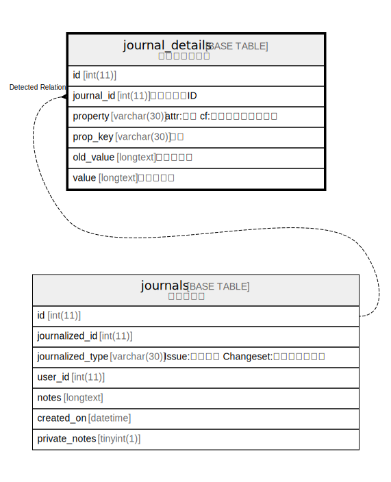

# journal_details

## Description

<details>
<summary><strong>Table Definition</strong></summary>

```sql
CREATE TABLE `journal_details` (
  `id` int(11) NOT NULL AUTO_INCREMENT,
  `journal_id` int(11) NOT NULL DEFAULT 0,
  `property` varchar(30) NOT NULL DEFAULT '',
  `prop_key` varchar(30) NOT NULL DEFAULT '',
  `old_value` longtext DEFAULT NULL,
  `value` longtext DEFAULT NULL,
  PRIMARY KEY (`id`),
  KEY `journal_details_journal_id` (`journal_id`)
) ENGINE=InnoDB DEFAULT CHARSET=utf8mb4 COLLATE=utf8mb4_general_ci
```

</details>

## Columns

| Name | Type | Default | Nullable | Extra Definition | Children | Parents | Comment |
| ---- | ---- | ------- | -------- | ---------------- | -------- | ------- | ------- |
| id | int(11) |  | false | auto_increment |  |  |  |
| journal_id | int(11) | 0 | false |  |  |  |  |
| property | varchar(30) | '' | false |  |  |  |  |
| prop_key | varchar(30) | '' | false |  |  |  |  |
| old_value | longtext | NULL | true |  |  |  |  |
| value | longtext | NULL | true |  |  |  |  |

## Constraints

| Name | Type | Definition |
| ---- | ---- | ---------- |
| PRIMARY | PRIMARY KEY | PRIMARY KEY (id) |

## Indexes

| Name | Definition |
| ---- | ---------- |
| journal_details_journal_id | KEY journal_details_journal_id (journal_id) USING BTREE |
| PRIMARY | PRIMARY KEY (id) USING BTREE |

## Relations



---

> Generated by [tbls](https://github.com/k1LoW/tbls)
