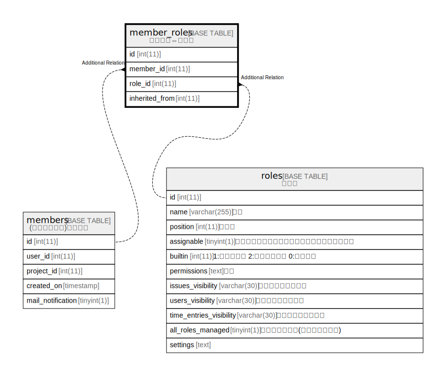

# member_roles

## Description

<details>
<summary><strong>Table Definition</strong></summary>

```sql
CREATE TABLE `member_roles` (
  `id` int(11) NOT NULL AUTO_INCREMENT,
  `member_id` int(11) NOT NULL,
  `role_id` int(11) NOT NULL,
  `inherited_from` int(11) DEFAULT NULL,
  PRIMARY KEY (`id`),
  KEY `index_member_roles_on_member_id` (`member_id`),
  KEY `index_member_roles_on_role_id` (`role_id`),
  KEY `index_member_roles_on_inherited_from` (`inherited_from`)
) ENGINE=InnoDB DEFAULT CHARSET=utf8mb4 COLLATE=utf8mb4_general_ci
```

</details>

## Columns

| Name | Type | Default | Nullable | Extra Definition | Children | Parents | Comment |
| ---- | ---- | ------- | -------- | ---------------- | -------- | ------- | ------- |
| id | int(11) |  | false | auto_increment |  |  |  |
| member_id | int(11) |  | false |  |  |  |  |
| role_id | int(11) |  | false |  |  |  |  |
| inherited_from | int(11) | NULL | true |  |  |  |  |

## Constraints

| Name | Type | Definition |
| ---- | ---- | ---------- |
| PRIMARY | PRIMARY KEY | PRIMARY KEY (id) |

## Indexes

| Name | Definition |
| ---- | ---------- |
| index_member_roles_on_inherited_from | KEY index_member_roles_on_inherited_from (inherited_from) USING BTREE |
| index_member_roles_on_member_id | KEY index_member_roles_on_member_id (member_id) USING BTREE |
| index_member_roles_on_role_id | KEY index_member_roles_on_role_id (role_id) USING BTREE |
| PRIMARY | PRIMARY KEY (id) USING BTREE |

## Relations



---

> Generated by [tbls](https://github.com/k1LoW/tbls)
