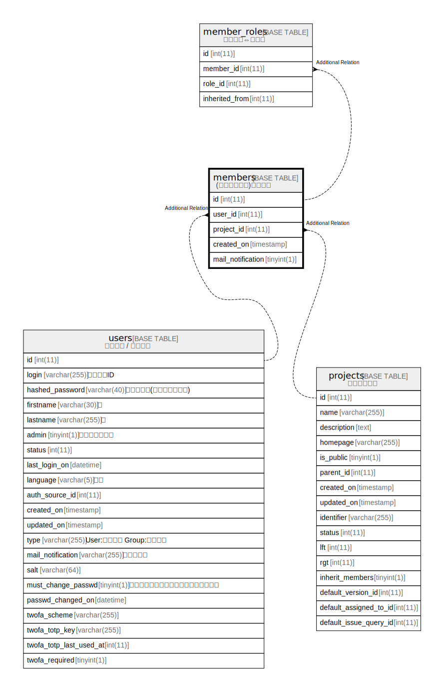

# members

## Description

<details>
<summary><strong>Table Definition</strong></summary>

```sql
CREATE TABLE `members` (
  `id` int(11) NOT NULL AUTO_INCREMENT,
  `user_id` int(11) NOT NULL DEFAULT 0,
  `project_id` int(11) NOT NULL DEFAULT 0,
  `created_on` timestamp NULL DEFAULT NULL,
  `mail_notification` tinyint(1) NOT NULL DEFAULT 0,
  PRIMARY KEY (`id`),
  UNIQUE KEY `index_members_on_user_id_and_project_id` (`user_id`,`project_id`),
  KEY `index_members_on_user_id` (`user_id`),
  KEY `index_members_on_project_id` (`project_id`)
) ENGINE=InnoDB DEFAULT CHARSET=utf8mb4 COLLATE=utf8mb4_general_ci
```

</details>

## Columns

| Name | Type | Default | Nullable | Extra Definition | Children | Parents | Comment |
| ---- | ---- | ------- | -------- | ---------------- | -------- | ------- | ------- |
| id | int(11) |  | false | auto_increment |  |  |  |
| user_id | int(11) | 0 | false |  |  |  |  |
| project_id | int(11) | 0 | false |  |  |  |  |
| created_on | timestamp | NULL | true |  |  |  |  |
| mail_notification | tinyint(1) | 0 | false |  |  |  |  |

## Constraints

| Name | Type | Definition |
| ---- | ---- | ---------- |
| index_members_on_user_id_and_project_id | UNIQUE | UNIQUE KEY index_members_on_user_id_and_project_id (user_id, project_id) |
| PRIMARY | PRIMARY KEY | PRIMARY KEY (id) |

## Indexes

| Name | Definition |
| ---- | ---------- |
| index_members_on_project_id | KEY index_members_on_project_id (project_id) USING BTREE |
| index_members_on_user_id | KEY index_members_on_user_id (user_id) USING BTREE |
| PRIMARY | PRIMARY KEY (id) USING BTREE |
| index_members_on_user_id_and_project_id | UNIQUE KEY index_members_on_user_id_and_project_id (user_id, project_id) USING BTREE |

## Relations



---

> Generated by [tbls](https://github.com/k1LoW/tbls)
