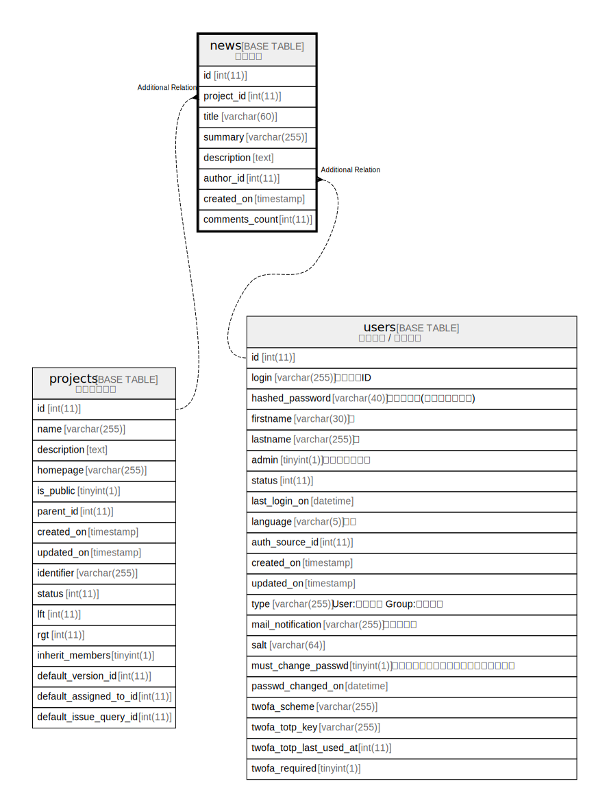

# news

## Description

<details>
<summary><strong>Table Definition</strong></summary>

```sql
CREATE TABLE `news` (
  `id` int(11) NOT NULL AUTO_INCREMENT,
  `project_id` int(11) DEFAULT NULL,
  `title` varchar(60) NOT NULL DEFAULT '',
  `summary` varchar(255) DEFAULT '',
  `description` text DEFAULT NULL,
  `author_id` int(11) NOT NULL DEFAULT 0,
  `created_on` timestamp NULL DEFAULT NULL,
  `comments_count` int(11) NOT NULL DEFAULT 0,
  PRIMARY KEY (`id`),
  KEY `news_project_id` (`project_id`),
  KEY `index_news_on_author_id` (`author_id`),
  KEY `index_news_on_created_on` (`created_on`)
) ENGINE=InnoDB DEFAULT CHARSET=utf8mb4 COLLATE=utf8mb4_general_ci
```

</details>

## Columns

| Name | Type | Default | Nullable | Extra Definition | Children | Parents | Comment |
| ---- | ---- | ------- | -------- | ---------------- | -------- | ------- | ------- |
| id | int(11) |  | false | auto_increment |  |  |  |
| project_id | int(11) | NULL | true |  |  |  |  |
| title | varchar(60) | '' | false |  |  |  |  |
| summary | varchar(255) | '' | true |  |  |  |  |
| description | text | NULL | true |  |  |  |  |
| author_id | int(11) | 0 | false |  |  |  |  |
| created_on | timestamp | NULL | true |  |  |  |  |
| comments_count | int(11) | 0 | false |  |  |  |  |

## Constraints

| Name | Type | Definition |
| ---- | ---- | ---------- |
| PRIMARY | PRIMARY KEY | PRIMARY KEY (id) |

## Indexes

| Name | Definition |
| ---- | ---------- |
| index_news_on_author_id | KEY index_news_on_author_id (author_id) USING BTREE |
| index_news_on_created_on | KEY index_news_on_created_on (created_on) USING BTREE |
| news_project_id | KEY news_project_id (project_id) USING BTREE |
| PRIMARY | PRIMARY KEY (id) USING BTREE |

## Relations



---

> Generated by [tbls](https://github.com/k1LoW/tbls)
